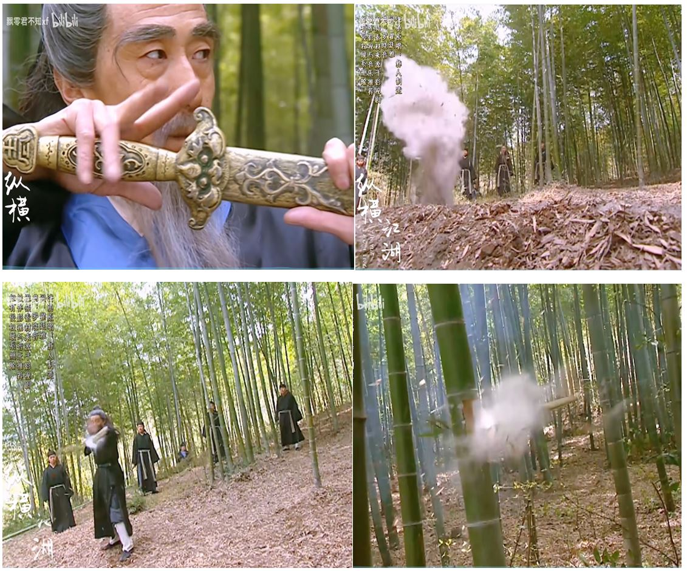

2025年：以歌词为主，也包含一些古诗词

最新 8.5

水灵/赵文卓 - 回首寒梅

作词: 陈心宁
作曲: 吕祯晃

一剪寒梅 绽放在你心头 

有你是春天 离开是寒夜 
我远远看着你垂泪 
伸手却触碰不到你的脸 
天上有流云 地上有彩蝶 
我遥遥望着你笑开了眉 
其实我早已飞到你的天 

我不会让你一个人走 
我今生不配同时拥有 
挽留了明月 挽不住风 
最美的承诺 就是你回眸 

我不会让你一个人走 
我为了爱你决定不走 
盼到了春天 留住了风 
夜才刚亮起 梦已重上心头 

一剪寒梅

  
  

-------
  

-------
戴娆 - 铁齿铜牙纪晓岚

作词: 邹静之
作曲: 丁缨

秋雁两行江上雨 
天南地北的人 
讲道理的是知己 
殿上君王堂下臣 
心存百姓的人 
百姓心中自有你 

说的都是理 
噢 唱的都是曲 
铁齿铜牙 两片嘴 
吃的是下锅的米 
噢 说的都是理 
噢 唱的都是曲 
铁齿铜牙 两片嘴 
吃的是下锅的米 

走的是人间的道 
扛的是顶风的旗 
铁齿铜牙两片嘴 
百姓心中有了你 

---------
甄妮 - 天子寻龙

作词：张浩
作曲：吴国恩 

平静 藏满斗争 
天清中有妖气沉 
人面 埋葬兽心 
色相多美最凶狠

凡间多悲惨 有大志早晚 
复我大唐江山 
邪灵和异兽 正蠢蠢作动 
聚势力再发难 
仇深 深似海 
情深 未遗忘是爱 
寻觅真龙皇不惜一战 
手足且肩并肩 
天仙请引路加指点 
智 勇 仍需锻炼 
期待真龙皇天子加冕 
心中所爱愿来日再现 
魔高一尺道高三千 
平乱世后再升天

------
  
  
  
  

-----
陈毅 - 梅岭三章

一九三六年冬，梅山被围。余伤病伏丛莽间二十余日，虑不得脱，得诗三首留衣底。旋围解。

（一）

断头今日意如何？创业艰难百战多。 
此去泉台招旧部，旌旗十万斩阎罗。 

（二）

南国烽烟正十年，此头须向国门悬。 
后死诸君多努力，捷报飞来当纸钱。 

（三）

投身革命即为家，血雨腥风应有涯。 
取义成仁今日事，人间遍种自由花。 

--------
  

--------
  

--------
  

--------
张卫健 - 虚虚实实

作词: 林敏骢
作曲: 温浩杰

假如我可以再生  
像太极为两仪而生  
动静（之）间如行云流水  
追一个豁达的眼神  

任膨湃巨力来打我  
牵动我四两拨千斤  
以弱可胜强  
后发可先至  
天大地大博大精深  

在虚虚在实实 神会中  
虚守实发掌中穷  
来势凶不为动  
所向无敌真英雄  
随心行动  
心底我是这样的人  

在虚虚在实实 现实中  
爱与不爱都很难  
伤依然那么深  
每一条路的尽头  
是一个人  
看不透世上的真  
你还是这样天真  

  
  
  
  

--------
邰正宵-找一个字代替

作词：林秋离
作曲：熊美玲

我想做一个梦给你   
填满你心中所有空隙   
让流过泪后的苦涩转成甜蜜   
我想摘两颗星给你   
放在你眺望我的眼里   
于是黑夜里你可以   
整夜看我如何地想你   
我想留一张纸给你   
告诉你我一生的际遇   
让受过伤后的刺痛随风而去   
我想沏一壶酒给你   
藏在你思念我的心底   
日后再相聚你听我醉后言语  
说的都是你  
翻篇日记将千言万语  
找一个字代替  
却发现爱是最深的痕迹  
想你就乱乱乱头绪  
不想又伤伤伤自己  
情深就不必问是合不合逻辑  
想你就乱乱乱头绪  
不想又伤伤伤自己  
刻一个爱给你在今生今世里  

-------------
纯音乐欣赏《换到千般恨》 
https://www.bilibili.com/video/BV16yxNeBEPh/

作词:卢国沾
作曲:黎小田

梦里百花正盛开 
梦醒再没有存在 
付过千般爱换到千般恨 
誓约已经变痛哀 
事已到此永难改 
莫非世事常意外 
让我哭千遍滴了千点泪 
誓约已经永不存在

痴情枉种永难继续 
但是未知天意何在 
空余感慨盼能有日 
我嘅爱心有人替代 
就算爱心变尘埃 
命中注定也无奈 
付过千般爱在你手上 
愿你暗中送它回来

------
周华健/齐豫 - 天下有情人

作词: 林夕
作曲: 周华健
编曲: 洪敬尧

爱怎么做怎么错怎么看怎么难 
怎么教人死生相随 
爱是一种不能说只能尝的滋味 
试过以后不醉不归 
等到红颜憔悴 
它却依然如此完美 
等到什么时候 
我们才能够体会 

爱是一朵六月天飘下来的雪花 
还没结果已经枯萎 
爱是一滴擦不干烧不完的眼泪 
还没凝固已经成灰 
等到情丝吐尽 
它才出现那一回 
等到红尘残碎 
它才让人双宿双飞 
啊…… 
有谁懂得个中滋味 

爱是迷迷糊糊 
天地初开的时候 
那已经盛放的玫瑰 
爱是踏破红尘 望穿秋水 
只因为爱过的人不说后悔 
爱是一生一世一次一次的轮回 
不管在东南和西北 
爱是一段一段 
一丝一丝的是非 
教有情人再不能够 说再会

------
周华健/齐豫 - 神话情话

作词: 林夕
作曲: 周华健
编曲: 洪敬尧

爱是愉快是难过是陶醉是情绪 
或在日后视作传奇 
爱是盟约是习惯是时间是白发 
也叫你我乍惊乍喜 
完全遗忘自己 
竟可相许生与死 
来日谁来问起 
天高风急双双远飞

爱是微笑是狂笑是傻笑是玩笑 
或是为着害怕寂寥 
爱是何价是何故在何世 
又何以对这世界雪中送火 
谁还祈求什么 
可歌可泣的结果 
谁能承受后果 
翻天覆海不枉最初 
啊…… 
有你有我雪中送火

爱在迷迷糊糊 
盘古初开便开始 
这浪浪漫漫旧故事 
爱在朦朦胧胧 
前生今生和他生 
怕错过了也不会知 
跌落茫茫红尘 
南北西东亦相依 
怕独自活着没意义 
爱是来来回回 
情丝一丝又一丝 
至你与我此生永不阔别时

------
刘若英 - 后来

作词: 施人诚
作曲: 玉城千春 
编曲: 王继康
制作人: 光良

后来 我总算学会了如何去爱 
可惜你 早已远去 消失在人海 
后来 终于在眼泪中明白 
有些人 一旦错过就不在

栀子花 白花瓣 
落在我蓝色百褶裙上 
爱你 你轻声说 
我低下头 闻见一阵芬芳 
那个永恒的夜晚 
十七岁仲夏 
你吻我的那个夜晚 
让我往后的时光 
每当有感叹 
总想起当天的星光 
那时候的爱情 
为什么就能那样简单 
而又是为什么 人年少时 
一定要让深爱的人受伤 
在这相似的深夜里 
你是否一样 也在静静追悔感伤 
如果当时我们能 
不那么倔强 
现在也 不那么遗憾

你都如何回忆我 
带着笑或是很沉默 
这些年来 
有没有人能让你不寂寞

永远不会再重来 
有一个男孩爱着那个女孩

------
许巍 - 曾经的你

词曲：许巍
编曲: 李延亮

曾梦想仗剑走天涯 
看一看世界的繁华 
年少的心总有些轻狂 
如今你四海为家 
曾让你心疼的姑娘 
如今已悄然无踪影 
爱情总让你渴望又感到烦恼 
曾让你遍体鳞伤 
DiLiLi…… 
走在勇往直前的路上 
DiLiLi…… 
有难过也有精彩 

每一次难过的时候 
就独自看一看大海 
总想起身边走在路上的朋友 
有多少正在疗伤 
DiLiLi…… 
不知多少孤独的夜晚 
DiLiLi…… 
从昨夜酒醉醒来

每一次难过的时候 
就独自看一看大海 
总想起身边走在路上的朋友 
有多少正在醒来 
让我们干了这杯酒 
好男儿胸怀像大海 
经历了人生百态世间的冷暖 
这笑容温暖纯真

------
梁静茹 - 会呼吸的痛

作词: 姚若龙
作曲: 宇珩
编曲: 安栋

在东京铁塔 
第一次眺望 
看灯火模仿 
坠落的星光 
我终于到达 
但却更悲伤 
一个人完成 
我们的梦想 
你总说时间还很多 
你可以等我 
以前我不懂得 
未必明天就有以后 

想念是会呼吸的痛 
它活在我身上所有角落 
哼你爱的歌会痛 
看你的信会痛 
连沉默也痛 
遗憾是会呼吸的痛 
它流在血液中来回滚动 
后悔不贴心会痛 
恨不懂你会痛 
想见不能见最痛 

没看你脸上 
张扬过哀伤 
那是种多么 
寂寞的倔强 
你拆了城墙 
让我去流浪 
在原地等我 
把自己捆绑 
你没说你也会软弱 
需要依赖我 
我就装不晓得 
自由移动 自我地过 

我发誓不再说谎了 
多爱你就会抱你多紧的 
我的微笑都假了 
灵魂像飘浮着 
你在就好了 
我发誓不让你等候 
陪你做想做的无论什么 
我越来越像贝壳 
怕心被人触碰 
你回来那就好了 
能重来 
那就好了

-------
乌兰托娅 - 爱不在就放手 

词曲：张毅

秋的眼 秋的眉 秋的水 
轻轻的风 随落花四处纷飞 
黄的花 黄的朵 黄的蕊 
亲爱的人我多想一生把你陪 

你的眼 你的泪 你的美 
忧伤的夜 就象那浓浓的咖啡 
我的梦 我的情 我的悲 
亲爱的人我多想一生把你陪 

爱情的感伤 
不一定是心碎 
思念这杯苦酒 
怎么喝也不醉 

爱不在就放手 
别变成负累 
就算痛到心碎 
也要走出包围 

太在意收获  
就会失去那种美  
**就算不停去追**  
**人生也没有完美**  

爱不在就放手 
别变成负累 
就算痛到心碎 
也要走出包围 

就算痛到心碎 
也要走出包围 

------
[4K/双语字幕] [荷东 第02集-05] Joe Lockwood - Hey You  
https://www.bilibili.com/video/BV1bsTuzkE2U/

荷东：东方好莱坞明星舞会，舞动青春的回忆杀~荷东（第二集） （Hollywood East Star Trax 2）  
https://www.bilibili.com/video/BV1VBosYVEww/

23分：Joe Lockwood - Hey You

She has a heart of gold 
The way to paradise is cold 
I know I know 
That this world is a show 
Love you more than words can say 
There is a will - there is a way 
I know I know 
hey hey hey ...  

I want you hey you 
Feel brand-new 
Oh I'll break the golden rules 
Time is on my side 
I want you hey you 
Take a chance on me 
Baby put your love on me 
I want you tonight

I want you hey you 
Little boo-ba-loo 
You shot a hole right in my soul 
Hey girl hey girl take this chance for love 
I want you hey you 
Little boo-ba-loo 
You want me and I want you 
Hey girl hey girl you're the one I'm dreamin' of

I'm tired of bein' alone 
Oh girl it's easier said than done 
I know I know 
That this world is a show 
Oh you wasted days and nights 
Give me the chance for paradise 
I know I know 

------
李白 - 梦游天姥吟留别

海客谈瀛洲，烟涛微茫信难求； 
越人语天姥，云霞明灭或可睹。 
天姥连天向天横，势拔五岳掩赤城。 
天台四万八千丈，对此欲倒东南倾。(四万 一作：一万) 

我欲因之梦吴越，一夜飞度镜湖月。 
湖月照我影，送我至剡溪。 
谢公宿处今尚在，渌水荡漾清猿啼。 
脚著谢公屐，身登青云梯。 
半壁见海日，空中闻天鸡。 
千岩万转路不定，迷花倚石忽已暝。 
熊咆龙吟殷岩泉，栗深林兮惊层巅。 
云青青兮欲雨，水澹澹兮生烟。 
列缺霹雳，丘峦崩摧。 
洞天石扉，訇然中开。 
青冥浩荡不见底，日月照耀金银台。 
霓为衣兮风为马，云之君兮纷纷而来下。 
虎鼓瑟兮鸾回车，仙之人兮列如麻。 
忽魂悸以魄动，恍惊起而长嗟。 
惟觉时之枕席，失向来之烟霞。 

世间行乐亦如此，古来万事东流水。 
别君去兮何时还？且放白鹿青崖间，须行即骑访名山。 
安能摧眉折腰事权贵，使我不得开心颜？

------
叶俊华 - 往事  伴奏 
https://5sing.kugou.com/bz/2235917.html

作词：陈旭东  作曲：黄水泉

是谁转动了记忆的魔方 
让往事走出来晒晒太阳 
过去的早插上风的翅膀 
留住的就让她在怀里疗伤 
往事是品不尽的七色酒 
往事是喝不完的百草汤 
往事是笑中的辛酸泪 
往事是苦里的话梅糖 

是谁转动了记忆的魔方 
让往事走出来看看月亮 
模糊的早淋上雨的油漆 
清晰的就让她在梦里飞扬 
往事是看不够的万花筒 
往事是冲不破的防火墙 
往事是命运的交响曲 
往事是人生的纪念章 
哎 嘿 

-------
王心凌 - 失恋歌迷党

作词: 陈静楠
作曲: 박성일

你想庆祝你重回了自由 
所以呼朋引伴要玩个够 
为我们共守好久的友情 
加油 

他说想移民最远的星球 
没有爱情也能度假享受 
吃大餐不必在乎为谁瘦 
现在就走 
让我们忠于自己的感受 
能不能有泪就流有歌就吼 
填满心底心底的缺口 
拿起麦克风加入失恋歌迷党 
今夜不清场 
你和我变身天后天王 
插播那首谁先唱 
喝掉胖大海加入失恋歌迷党 
用快乐开嗓 
歌声把伤心统统死当 
快歌慢歌你最棒 
为你鼓鼓掌 

1234举着手今晚要唱个够
谁要先走是小狗嘿 
该他了 let's go! 

1234换个姿势 
超快歌再来一首 
我们伴舞伴奏 
你的go来喽 

------
谢霆锋 - 只要为你活一天 

词曲：洪典

爱上了你 爱上了你 
注定的是你 我输得彻底 
爱上了你 爱上了你 
早预言了分离 决定了悲剧 

上天给了我多少时间 
全都给你 我忘了我自己 
赶在生命里有限的时间里 
就让这一刻停在这里 

只要为你再活一天 我愿意 
不管明天就算有更坏的消息 
只要为你再活一天 我的心 
我的心 就会满意 

da la dang(da la dang) dang..dang..dang da la.. dang..dang.. 
da la dang(da la dang) dang..dang..dang da la.. dong..ang..

--------
庞龙 - 兄弟抱一下

词曲：蔡龙波

兄弟你瘦了 看着疲惫啊  
一路风尘盖不住 岁月的脸颊  
兄弟你变了 变得沉默了  
说说吧 那些放在 心里的话  
兄弟我们的青春 就是长在那心底  
经过风吹雨打 才会开的花  

兄弟你说了 以后就不拼了  
只想做爱情的傻瓜 只想安稳有个家  
是啊我们都变了 变的现实了  
不再去说那些年少热血的话  
兄弟我们都像是 山坡滚落的石子  
都在颠碰之中磨掉了尖牙  

兄弟抱一下 说说你心里话  
说尽这些年你的委屈 和沧桑变化  
兄弟抱一下 有泪你就流吧  
流尽这些年深埋的 辛酸和苦辣  

兄弟抱一下 为岁月的牵挂 
为那心中曾翻滚的 汹涌的浪花 
为哥们并肩走过的 青春的年华 

让深埋的话抚慰那久违的泪花

------
甘萍 - 潮湿的心

作词: 李广平
作曲: 兰斋

是什么淋湿了我的眼睛 
看不清你远去的背影 
是什么冰冷了我的心情 
握不住你从前的温馨 

是雨声喧哗了我的安宁 
听不清自己哭泣的声音 
是雨伞美丽了城市的风景 
留不住身边匆忙的爱情 

谁能用爱烘干我这颗潮湿的心 
给我一声问候 一点温情 
谁能用心感受我这份滴水的痴情 
给我一片晴空 一声叮咛 

------
陈浩民/刘玉翠 - 封神

作词:邓永威 作曲:巫思聪

仙神人鬼从今定 不使朝朝坠草莱
太上原始天尊敕令“五方之神,来受命耳”: 此乃"封神榜"

暴君 率众妖害人 
人间 积怨何容忍 
全因 这世魔道行 
苍天恨 
齐心 甘与苦共盟 
哪吒 不怕雷霆震 
誓死 驱散魔道人 
解厄运 
血耗尽 
愿能为你得永生 
孝与义 惊天地 
痛爱我 不计心和神 
但遇着 这算是缘份 
纵再见 亦难续恩情 
孝义 永在心

  
  
  

------
陈粒-小半

作词:涂玲子
作曲:陈粒

不敢回看 
左顾右盼不自然的暗自喜欢 
偷偷搭讪总没完地坐立难安 
试探说晚安 多空泛又心酸 

低头呢喃 
对你的偏爱太过于明目张胆 
在原地打转的小丑伤心不断 
空空留遗憾 多难堪又为难 
释然 慵懒 尽欢 时间风干后你我再无关 
没答案 怎么办 看不惯我自我欺瞒 

纵容着 喜欢的 讨厌的 宠溺的 厌倦的 
一个个慢慢黯淡 
纵容着 任性的 随意的 放肆的 轻易的 
将所有欢脱倾翻 
不应该 太心软 不大胆 太死板 不果断 
玩弄着肆无忌惮 
不应该 舍弃了 死心了 放手了 断念了 
无可奈何不耐烦 
不算 

灯火阑珊 
我的心借了你的光是明是暗 
笑自己情绪太泛滥形只影单 
自嘲成习惯 多敏感又难缠 

任由着 你躲闪 我追赶 你走散 我呼喊 
是谁在泛泛而谈 
任由着 你来了 你笑了 你走了 不看我 
与理所当然分摊 
不明白 残存的 没用的 多余的 不必的 
破烂也在手紧攥 
不明白 谁赧然 谁无端 谁古板 谁极端 
无辜不知所以然 

-------
谭咏麟&毛阿敏 神的传说

作词: 张名河
作曲: 刘念劬/马友道

花开花落花开花落 
悠悠岁月长长的河 
一个神话就是浪花一朵 
一个神话就是泪珠儿一颗 
聚散中有你 
聚散中有我 
你我匆匆皆过客 
日出日落日出日落 
长长岁月悠悠的歌 
一滴苦酒就是史书一册 
一滴热血就是丰碑一座 
呼唤中有你 
呼唤中有我 
喜怒哀乐都是歌

看千古烟波浩荡 
奔流着梦的希冀 
梦的嘱托 梦的嘱托 
奔流着梦的希冀 梦的嘱托 
听万民百世轻唱 
只留下神的飘逸 
神的传说 神的传说 
只留下神的飘逸 神的传说 

-------
王心凌 Cyndi Wang《匿名的安慰》

作词:易家扬 作曲:林俊杰

我 已不再掉眼泪 
很努力地体会 这个世界不完美 
这旅途多少胜利与败退 
领悟 现实的吊诡

心 在乱流中学飞 
有时候很累 但我听见别气馁 
是谁站在远处守护我 
无声但是可贵

这孤单太完美 
匿名的安慰 
不知道替我祝福的人他是谁 
梦境别粉碎 因为和未来的约会 
叫我往前追

这孤单太完美 
包容不完美 
像一颗钻石裹着脆弱的心扉 
我对自己说 伤心之后另一次机会 
我会全心的奉陪/谢谢这孤单的美

-------
毛阿敏 - 历史的天空

作词: 王健 
作曲: 谷建芬

暗淡了刀光剑影 
远去了鼓角铮鸣 
眼前飞扬着一个个 
鲜活的面容 

湮没了黄尘古道 
荒芜了烽火边城 
岁月啊你带不走 
那一串串熟悉的姓名  
兴亡谁人定 啊 
盛衰岂无凭 啊 
一页风云散 啊 
变幻了时空 
聚散皆是缘 啊 
离合总关情 啊 
担当生前事 啊 
何计身后评 
长江有意化作泪 
长江有情起歌声 
历史的天空闪烁几颗星 
人间一股英雄气 
在驰骋纵横

------
姜育恆 - 再回首

作词:陈乐融 作曲:卢冠廷

再回首 雲遮斷歸途 
再回首 荊棘密布 
今夜不會再有 難捨地舊夢 
曾經與你有的夢 今後要向誰訴說 
再回首 背影已遠走 
再回首 淚眼朦朧 
留下你的祝福 寒夜溫暖我 
不管明天要面對 多少傷痛和迷惑 

曾經在幽幽暗暗反反覆覆中追問 
才知道平平淡淡從從容容才是真 
再回首 恍然如夢  
再回首 我心依舊 
只有那無盡的長路 伴着我

------
王英姿 - 月亮船

作词: 王浩
作曲: 肖白

我能够 捉到月亮 
我将用 无数的梦 
撑起 无数的桨 
用勇敢和智慧 做我的船桨 
摇着月亮船 驶向远方～ 
如果 我能够捉到月亮 
我会用蜡笔 画出银河的气势 
我会用算术 数清所有的星星 
把最亮的一颗 戴在胸上 

再见了 妈妈 
今晚我就要远航 
别为我担心 
我有快乐和智慧的桨 
当你醒来 千万别告诉别人 
我正摇着月亮船 在银河上远航～ 

------
范玮琪 - 一个像夏天一个像秋天

作曲: 陈小霞
作词: 姚若龙

第一次见面看你不太顺眼 
谁知道后来关系那么密切 
我们一个像夏天一个像秋天 
却总能把冬天变成了春天 

你拖我离开一场爱的风雪 
我背你逃出一次梦的断裂 
遇见一个人然后生命全改变 
原来不是恋爱才有的情节 

如果不是你 我不会相信 
朋友比情人还死心塌地 
就算我忙恋爱 把你冷冻结冰 
你也不会恨我 只是骂我几句 

如果不是你 我不会确定 
朋友比情人更懂得倾听 
我的弦外之音 我的有口无心 
我离不开Darling 更离不开你 

你了解我所有得意的东西 
才常泼我冷水怕我忘形 
你知道我所有丢脸的事情 
却为我的美好形象保密

------
ZARD - 负けないで

作曲: 织田哲郎
作词: 坂井泉水

不经意的瞬间 我们的目光相遇  
那种幸福的心跳 你一定还记得吧  
我爱上了这个色调柔和的季节 
像那日一样  闪耀着光芒   
就是你的样子 

别认输  再加一点油 
请一定坚持 跑到最后 

不论离你有多远 
我的心 始终在你的身边 
追着你那遥远的梦想去吧 

不论发生任何事   
你都装作一副若无其事的样子 
总会有办法的啦 你总是故作轻松 
“今晚和我一起跳支舞吧” 
一直到现在 也依然喜欢这样的你  
不要忘了 

不要认输 你看那里 
目的地已经越来越近 
无论相隔多么遥远 
我的心 始终在你的身边 
你感觉到了吧 我注视着你的目光 

------
孙耀威 - 爱的故事上集

作词: 潘伟源
作曲: George Takahash

星的光点点洒于午夜 
人人开开心心说说故事 
偏偏今宵所想讲不太易 
迟疑地望你想说又复迟疑 
秋风将涌起的某夜 
遗留她的窗边有个故事 
孤单单的小伙子不顾寂寞 
徘徊树下直至天际露月儿 

冬风吹走几多个月夜 
为何窗边的她欠缺注视 
刻于窗扉小子写的爱慕字 
完全没用像个飘散梦儿 
今宵的小伙子倾吐憾事 
谁人痴痴的要再听故事 
偏偏痴心小子只知道上集 
祈求下集是个可爱梦儿 

知不知对你牵上万缕爱意 
每晚也痛心空费尽心思 
这小子欲断难断这故事 
全为我爱上你偏偏你不知 

春风轻吹点点火花衬月夜 
人人开开心心说说故事 
终于倾出这小子的往事 
长年累月为你怎再自持 
今宵知否对你的暗示 
为何真的将它当故事 
偏偏痴心小子只知道上集 
祈求下集是个可爱梦儿 

知不知每晚想你十次百次 
每晚也去等 因我极心痴 
可不可合力延续这故事 
延续这片爱意一生俩相依 

-------
薛家燕 - 皆大欢喜  

作词: 李紫昕
作曲: 李紫昕

漫步挽手走遍万里千山 
信念编出欢欣世间 
未惧怕山高远路几多弯 
万众齐心 莫怨路难 
唏呀唏呀唏呀唏唏呀唏呀唏呀唏 
一生中 寻寻觅觅多感慨 
是笑是哀 难计得失意外 

唏呀唏呀唏呀唏呀唏 
团结一心有新转机 
哪怕是万尺风浪 
都可挽手冲天飞 
唏呀唏呀唏呀唏呀唏 
团聚分享快乐园地 
笑与泪在你我之间 
人生多惊喜 

伴着你轻舟悄悄净过千滩 
心里千古我是无限 
淡淡背影深印在我心间 
难过情关万水千山 
唏呀唏呀唏呀唏唏呀唏呀唏呀唏 
一生中离离合合是否应该 
是笑是哀难计得失意外 

---------
周美茵-没有忘掉的面容

作词: 林振强
作曲: Gibson Deborah Ann

在六七岁 婆婆来港探望  
在那行李边 跟她初见面  
婆婆望真我 慈祥呵一呵  
那面容 至今未忘掉  

在十二三岁 微凉的晚上  
有巡回戏班 把天空擦亮  
红蓝绿丑角 齐前来给我望  
那面容 至今未忘掉  

岁月纵如横飞过的箭  
却总遗留一些记念  
朋友你心底可会有  
记低谁人的亲切面  
纵不可再 见多一面  

在十七岁 难明了的晚上  
父母同意分手 天不再亮  
而妈妈于街里 仍回头把我望  
那面容 至今未忘掉  

人浮过秋冬与春夏  
历经许多转变  
怎麽心里仍是会挂念一些碎片  
朋友你心底可会有  
记低谁人的亲切面  
如祈求重逢前心窝可以暖点  

某面容 至今未忘掉  
某面容 至今未忘掉  

-------
邓丽君 - 小城故事

作词: 庄奴
作曲: 翁清溪/（汤尼）

小城故事多 
充满喜和乐 
若是你到小城来 
收获特别多 

看似一幅画 
听像一首歌 
人生境界真善美这里已包括 

谈的谈说的说 
小城故事真不错 
请你的朋友一起来 
小城来做客

------
朴树 - 平凡之路

作词: 朴树/韩寒
作曲: 朴树

徘徊着的 在路上的 
你要走吗 via via 
易碎的 骄傲着 
那也曾是我的模样 
沸腾着的 不安着的 
你要去哪 via via 
谜一样的 沉默着的 
故事你真的 在听吗

我曾经跨过山和大海 
也穿过人山人海 
我曾经拥有着的一切 
转眼都飘散如烟 
我曾经失落失望 
失掉所有方向 
直到看见平凡 
才是唯一的答案 
当你仍然 还在幻想 
你的明天 via via 
她会好吗 还是更烂 
对我而言 是另一天 
我曾经毁了我的一切 
只想永远地离开 
我曾经堕入无边黑暗 
想挣扎无法自拔 
我曾经像你像他 
像那野草野花 
绝望着 也渴望着 
也哭也笑平凡着

向前走 就这么走 
就算被给过什么 
向前走 就这么走 
就算被夺走什么 
向前走 就这么走 
就算会错过什么 
向前走 就这么走 就算会

我曾经跨过山和大海 
也穿过人山人海 
我曾经问遍整个世界 
从来没得到答案 
我不过像你像他 
像那野草野花 
冥冥中 这是我 
唯一要走的路啊 
时间如烟 如此这般 
明天已在 hia hia 
风吹过的 路依然远 
你的故事讲到了哪

-------
杨千嬅 - 小城大事

作词: 林夕
作曲: 雷颂德

青春仿佛因我爱你开始 
但却令我看破爱这个字 
自你患上失忆 
便是我扭转命数的事 
只因当失忆症发作加深 
没记住我但却另有更新蜜运 
像狐狸精般 
并未允许我步近 
无回忆的余生 
忘掉往日情人 
却又记住移情别爱的命运 
无回忆的男人 
**就当偷厄与瞒骗** 
**抱抱我不过份** 

**吻下来 豁出去** 
**这吻别似覆水** 
**再来也许要天上团聚** 
**再回头 你不许** 
**如曾经不登对** 
**你何以双眼好像流泪** 

彼此追忆不怕爱要终止 
但我大概上世做过太多坏事 
能从头开始 
跪在教堂说愿意 
娱乐行的人影 
还在继续繁荣 
我在算着甜言蜜语的寿命 
人造的蠢卫星 
没探测出我们已 
已再见不再认 

吻下来 豁出去 
这吻别似覆水 
再来也许要天上团聚 
**我下来 你出去** 
**讲再会也心虚** 
**我还记得到天上团聚** 
吻下来 豁出去 
从前多么登对 
你何以双眼好像流泪 

每年这天记得再流泪

-------
张北北 - 拥抱你离去

作词：刘涛

拥抱着你的离去 
数着一行行的泪滴 
枕着梦这回忆不忍睡 
寂寞夜只剩我的狼狈 
谎言天花乱坠 
目睹你和他的暧昧 
我的心在慢慢枯萎 
悄悄地碎 

如果亲爱的心痛 
不爱的保重 
难爱的却成空 
让我再一次感受你的温柔 
如果他更适合你依偎 
悲伤该如何全身而退 

爱情已经已无所谓/ 
你的干脆我没防备

-------
成龙 - 醉拳

作词: 厉曼婷
作曲: 李偲菘/李伟菘

我颠颠又倒倒 好比浪涛 
有万种的委屈 付之一笑 
我一下低 我一下高 
摇摇晃晃不肯倒 
酒里乾坤我最知道 

江湖中闯名号 从来不用刀 
千斤的重担我一肩挑 
不喊冤也不求饶 
对情意我肯弯腰 
醉中仙好汉一条 

莫说狂 狂人心存厚道 
莫笑痴 因痴心难找 
莫怕醉 醉过海阔天高 
且狂且痴且醉趁年少/在今朝 

干了吧 站稳脚步你放轻松 
酒过三巡你别偷溜 
棒打老虎鸡吃虫 
鸡吃了虫 它变成龙 
看我脸红脖子也粗 
心里明白我是英雄啊 
六六六啊 顺五六啊 
三星照啊 四季财啊 
七匹马啊 两相好啊 
五魁首啊 一定中 全到了啊 
三星照 四季财啊 
七匹马 两相好啊 五魁首啊 
江湖中闯名号 从来不用刀 

------
井上杏美 - 君をのせて

作词:宫崎骏
作曲:久石让 

远方地平线 闪耀着光芒 
那是因为 有你在后面 
点滴岁月令人如此怀念 
是因为 有你相伴 
来，出发吧 
把面包片、小刀和手提灯 
塞进背包里 

还有爸爸 留下的热情 
妈妈眼中的深情 

世界不停转动 有你藏在其中 
闪烁的瞳孔 闪烁的灯光 

世界不停转动 伴随着你 
伴随着我们 直到重逢之日 

---------
天空之城  主题曲（粤语版）（我电脑里是4分12秒版本） 
https://dai.ly/k6NDovTChWAE0jD6q6Q

作词：未知  作曲：久石让

传说在那天上 在天际的深处 
有座美丽雷泊地 隐隐的飘浮云中央 
仍未揭露它真相 又未找到它方向 
愿能有日 向天空飞去 
找出那探访路向  
探访天际的家乡 
云层里是我家乡  
寻觅快乐温馨的爱巢 心中的理想  
在天空中有座城 有小野花飘香  
在天空中有座城 鸟声似歌柔扬 
凝视我望向天上 在心里轻轻唱 
朦胧我像听到了 
家乡的鸟儿 在和唱 
谁愿意伴我一路 尽力找到它方向 
愿望能有日向天空飞去 
找到我理想路向

------
甄妮 - 春雨弯刀

作词: 邓伟雄
作曲：顾嘉煇

情情怨怨在春雨里 
仇仇恨恨在弯刀边 
耀目刀锋光似冰霜 
难断春雨密绵绵 
频频笑笑在春雨里 
名名利利在弯刀边 
断石分金刚胜青霜 
难断心里恨绵绵 

心似絮还乱 
恩似灭还现 
万般得失 万般爱恶 
尽在江湖了断 

情情怨怨消失春雨里 
名名利利灭却弯刀边 
独剩凄风吹冷肝胆 
陪伴那春雨密绵绵 

-------
乌兰托娅 - 套马杆

作词:刘新圈 作曲:郭永利

给我一片蓝天一轮初升的太阳 
给我一片绿草绵延向远方 
给我一只雄鹰一个威武的汉子 
给我一个套马杆攥在他手上 
给我一片白云一朵洁白的想象 
给我一阵清风吹开百花香 
给我一次邂逅在青青的牧场 
给我一个眼神热辣滚烫 

**套马的汉子你威武雄壮** 
**飞驰的骏马像疾风一样** 
一望无际的原野随你去流浪 
你的心海和大地一样宽广 
套马的汉子你在我心上 
我愿融化在你宽阔的胸膛 
一望无际的原野随你去流浪 
所有的日子像你一样晴朗 
