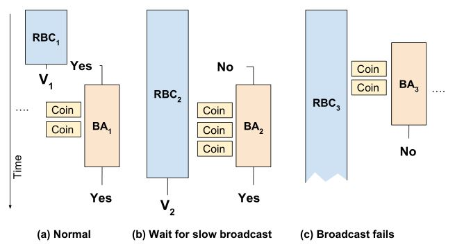

接“为了求解集合约束系统，执行以下操作：”

1. 每个约束变量 x 都有一个与其关联的解集 Sol(x)。

2. 约束分为直接约束、复制约束和复杂约束。
直接约束是 ADDRESSOF 约束，不需要额外的处理，例如 P = &Q
复制约束是 P = Q 形式的约束。
复杂约束是所有涉及解引用和偏移量的约束（包括偏移量复制）。

3. 处理所有 P = &Q 形式的直接约束，使得 Q 被添加到 Sol(P) 中。

4. 给定约束变量的所有复杂约束都存储在其节点附加的链表中。

5. 根据复制约束构建一个有向图。每个约束变量都是图中的一个节点，对于每个 P = Q 形式的复制约束，从 Q 到 P 添加一条边。

6. 然后遍历该图，并将解集沿复制边传播，使得从 Q 到 P 的边导致 Sol(P) <- Sol(P) union Sol(Q)。

7. 当访问每个节点时，通过将适当的复制边添加到图中，或将适当的变量添加到解集中，来处理与该节点关联的所有复杂约束。

8. 重复遍历图的过程，直到没有解集发生变化。

在步骤 6 和 7 中遍历图之前，我们对约束图执行静态循环消除以及离线变量替换。

TODO：可以处理指向结构体的偏移量（即不会被忽略并转换为其他形式），但目前没有实现。您可以直接查看它将访问指向结构体中的哪个偏移量。

TODO：可以将常量边界数组处理为具有相同数量元素的结构体。

TODO：如果我们在发现它们时为它们添加字段，那么对堆和传入指针的建模会变得更好。

TODO：我们可以处理联合，但老实说，它可能不值得付出代价或减慢速度。

IPA-PTA 优化可能性。

当间接调用的函数是任何东西时，我们可以根据函数签名（或简单地是 varinfo 大小参数计数）添加歧义消除。我们也不需要考虑没有获取其地址的函数。

is_global_var 位标记逃逸点在 IPA 模式下过于保守。将其拆分为 is_escape_point 和 is_global_var - 只有外部可见的全局变量在 IPA 模式下才是逃逸点。
现在有 is_ipa_escape_point，但这仅在少数选定位置使用。

我们引入 DECL_PT_UID 的方式是为了避免在内联期间复制 DECL 时修复翻译单元中的所有指向集合，这会降低精度。优点是 DECL_PT_UID 保持编译时和内存使用开销较低 - 指向集合不会在修复阶段增长或变得不共享。
另一种解决方案是在所有内联转换都应用后延迟 IPA PTA。

我们传播覆盖/使用信息的方式没有得到优化。它应该使用一种新的复杂约束，该约束正确地过滤掉被调用者的局部变量（尽管这将使集合在内联后无效）。另一方面，我们不妨承认 WHOPR 的失败，并在 PTA 完成但我们丢弃内存变量的指向信息之前简单地执行所有覆盖/使用分析和传播。WHOPR 和 PTA 并没有很好地配合 - 整个约束求解都需要在 WPA 阶段完成，并将结果应用于 LTRANS 阶段的局部 SSA 名称将非常有趣。

我们可能应该计算每个函数单元的 ESCAPE 解决方案，并像覆盖/使用解决方案一样传播它。该解决方案可以与非 IPA espaced 解决方案一起使用，并用于查询哪些变量通过函数逃逸单元。这对于使逃逸的 HEAP 技巧在 IPA 模式下起作用也是必需的。

我们从不将函数声明放入指向集合中，因此我们不会为间接调用保留调用的函数集。

用于前任位图。 <br>
用于指向集合。 <br>
用于变量的 oldsolution 成员。 <br>
用于每个求解器迭代的位图。 <br>
此变量的 ID 
如果此变量是由约束分析创建的，例如堆变量和我们必须拆分的约束，则为真。 <br>
如果此变量是一个特殊变量，其解集不应更改，则为真。 <br>
如果此变量的大小未知或可变，则为真。 <br>
如果此（子）字段表示整个变量，则为真。 <br>
如果此变量是堆变量，则为真。 <br>
如果此字段可能包含指针，则为真。 <br>
如果此字段仅具有 restrict 限定的指针，则为真。 <br>
如果这表示为 restrict 限定指针创建的堆变量，则为真。 <br>
如果这表示全局变量，则为真。 <br>
如果这表示 IPA 分析的模块逃逸点，则为真。 <br>
如果这表示 IPA 函数信息，则为真。 <br>
??? 在更好的地方存储。 <br>
此结构中下一个字段的变量的 ID，如果此结构中的最后一个字段为零。 <br>
此结构中第一个字段的变量的 ID。 <br>
此变量的偏移量，以位为单位，从基本变量开始 
变量的大小，以位为单位。 <br>
基本变量的完整大小，以位为单位。 <br>
此变量的名称 
与此变量关联的树。 <br>
此变量的指向集合。 <br>
此变量的旧指向集合。 <br>
变量信息结构的池。 <br>
将 varinfo 映射到最终的 pt_solution。 <br>
约束变量的变量信息结构表。
直接按变量信息 ID 索引。 <br>
返回 varmap 元素 N
返回 VI 的子变量列表中的下一个变量，
如果 VI 是最后一个子变量，则为 NULL。 <br>
特殊变量的静态 ID。变量 ID 零未使用
并用作子变量链的终止符。 <br>
返回一个新的变量信息结构，该结构由名为 NAME 的变量组成，并使用约束图节点 NODE。
将其附加到变量信息结构的向量中。 <br>
没有声明的变量是人工创建的，没有子变量。 <br>
我们必须将即使是本地寄存器变量也视为逃逸点。 <br>
一个映射，将调用语句映射到用于特定于调用的使用和覆盖的每个语句变量。 <br>
查找或创建调用语句 CALL 的变量。 <br>
查找表示调用的变量 CALL，
表示使用。如果此调用没有特殊之处，则返回 NULL。 <br>
查找表示调用的变量 CALL，
表示覆盖。如果此调用没有特殊之处，则返回 NULL。 <br>
查找或创建表示调用的变量 CALL，
表示使用。 <br>
查找或创建表示调用的变量 CALL，
表示覆盖。 <br>
出现在约束中的表达式。 <br>
约束类型。 <br>
我们在约束中引用的变量。 <br>
此约束从其最终引用的变量开始的偏移量，以位为单位。

换句话说，在解引用约束中，我们将解引用，获取结果集，
然后将 OFFSET 添加到每个成员。 <br>
将 0x8000... 用作特殊未知偏移量。 <br>
我们的集合约束由两个约束表达式组成，一个 LHS 和一个 RHS。

如引言所述，我们的每个集合约束都表示集合值变量之间的操作。 <br>
我们用来构建约束图的约束列表。 <br>
约束图表示为包含后继节点的位图数组。 <br>
此图的大小，它可能与变量映射中的节点数不同。 <br>
每个节点的显式后继。 <br>
每个节点的隐式前驱（用于变量替换）。 <br>
每个节点的显式前驱（用于变量替换）。 <br>
间接循环代表，如果节点没有间接循环，则为 -1。 <br>
节点的代表节点。如果节点已合并，则 rep[a] == a。 <br>
标签的等价类代表。这用于变量替换。 <br>
节点的指针等价标签。所有具有相同指针等价标签的节点都可以
在某个时刻统一在一起（在约束优化期间或构建约束图后）。 


指针等价的代表标签，用于处理指针等价但位置并不等价的节点。一旦取地址（addressof）约束被转化为初始的指针指向集，我们可以将这些节点统一起来。<br>  
每个节点的指针等价标签，用于变量替换期间。<br>  
每个节点的位置等价标签，用于位置等价查找期间。<br>  
每个节点的被指向集（pointed-by set），用于位置等价查找。这是“被指向集”而非“指向集”，因为它是使用前驱图构建的。<br>  
用于指针等价的指向集。这*不是*节点的实际指针指向集。<br>  
设置了位的节点位图，如果节点是直接节点，则位被设置。用于变量替换。<br>  
设置了位的节点位图，如果节点取了地址，则位被设置。用于变量替换。<br>  
每个图节点的复杂约束向量。复杂约束是那些涉及解引用或偏移量（偏移量非 0）的约束。<br>  
在变量替换和间接循环查找的离线版本中，我们创建节点以表示解引用和取地址约束。这些节点表示这些约束的起点和终点。<br>  
返回节点 NODE 的代表节点，如果 NODE 已经与另一个节点合并，则返回代表节点。<br>  
此函数在查找代表节点的过程中执行路径压缩。<br>  
将 TO 和 FROM 节点合并到 TO 节点中。<br>  
需要注意的是，在未来某个时候，我们可能会想要使用按秩合并（union-by-rank），在这种情况下，我们需要返回被合并到的节点。<br>  
创建一个由 LHS 和 RHS 表达式组成的新约束。<br>  
将约束 C 打印到文件 FILE 中。<br>  
将约束 C 打印到标准错误输出（stderr）中。<br>  
将所有约束打印到文件 FILE 中。<br>  
将所有约束打印到标准错误输出中。<br>  
以 dot 格式打印约束图。<br>  
仅当图已经被初始化时才打印图：<br>  
打印 dot 文件的头部：<br>  
接下来的几行打印图中的节点及其附加的复杂约束。<br>  
遍历边。<br>  
打印 dot 文件的尾部。<br>  
将约束图打印到标准错误输出中。<br>  

**求解器函数**  

求解器是一个简单的工作列表求解器，基于以下算法：<br>  

```c
sbitmap changed_nodes = 全零;
changed_count = 0;
对于每个尚未折叠的节点：
  changed_count++;
  在changed_nodes中设置位

当(changed_count > 0)
{
  计算约束图的拓扑排序

  在约束图中找到并折叠循环（必要时更新 changed）

  对于图中的每个节点 (n)，按照拓扑顺序：
    changed_count--;

    处理与该节点关联的每个复杂约束， 必要时更新changed。

    对于 n 的每个传出边，将 n 的解传播到边的目的地， 必要时更新changed。
}
```


如果两个约束表达式 A 和 B 相等，则返回 true。<br>  
如果约束表达式 A 小于约束表达式 B，则返回 true。这只是一个任意但一致的规则，用于为它们提供一个排序。<br>  
如果约束 A 小于约束 B，则返回 true。这只是一个任意但一致的规则，用于为它们提供一个排序。<br>  
如果两个约束 A 和 B 相等，则返回 true。<br>  
在排序的约束向量 VEC 中查找约束 LOOKFOR。<br>  
合并两个约束向量 TO 和 FROM，并将结果放入 TO 中。如果 TO 集发生变化，则返回 true。<br>  
将解集中包含的变量扩展到所有子字段。<br>  
在第一轮中，扩展到我们需要添加其所有子字段的变量头部。这可以避免出现二次复杂度的行为。<br>  
在第二轮中，扩展所有具有子字段的头部变量。<br>  
最后，将 SET 中的剩余位设置完成。<br>  
将解集 DELTA 合并到解集 TO 中，同时将增量 INC 添加到 DELTA 的每个成员。<br>  
如果 DELTA 的解集中包含任何内容，则可以将其转移到 TO 中，这就足够了。<br>  
如果偏移量未知，则必须将解集扩展到所有子字段。<br>  
对于非零偏移量，将带有偏移量的解集合并到目标中。<br>  
如果这是只有一个字段的变量，只需在结果中设置其位即可。<br>  
如果偏移量使指针指向变量之前的位置，则在字段查找中使用偏移量零。<br>  
必须包含所有与当前字段重叠的字段，并根据增量进行调整。<br>  
将约束 C 插入到图节点 VAR 的复杂约束列表中。<br>  
仅插入不存在的约束。<br>  
将两个变量节点合并为一个变量节点，通过将所有相关信息从 FROM 节点移动到 TO 节点。如果合并后 TO 节点的约束集发生变化，则返回 true。<br>  
将复杂约束从来源节点移动到目标节点。<br>  
在节点 FROM 的复杂约束中，我们可能有 `a = *FROM` 或 `*FROM = a`，或者有偏移量的约束，这些约束总是被添加到 RHS 节点的约束中。<br>  
从图中删除涉及节点 NODE 的边。<br>  
将图中的节点 FROM 和 TO 合并到节点 TO 中。<br>  
如果 FROM 节点存在间接循环，而 TO 节点没有，那么在它们被统一后，TO 节点现在也会继承 FROM 节点的间接循环。<br>  
如果两者都有间接循环，则将它们所涉及的间接循环的节点统一起来，因为它们现在互相处于循环中。<br>  
合并所有后继边。<br>  
如果图中不存在从 TO 到 FROM 的间接图边，则添加一条。<br>  
如果图中不存在从 TO 到 FROM 的前驱图边，则添加一条。如果边已存在，则返回 false，否则返回 true。<br>  
如果图中不存在从 FROM 到 TO 的图边，则添加一条。如果边已存在，则返回 false，否则返回 true。<br>  
初始化约束图结构，使其包含 SIZE 个节点。<br>  
由于宏不支持具有多个参数的模板类型，因此使用 typedef 作为解决方法。<br>  
构建约束图，目前仅添加前驱边。<br>  

*x = y<br>  
x = *y<br>  
x = &y<br>  
隐式地，*x = y<br>  
所有相关的变量不再是直接节点。<br>  
x = y<br>  
隐式地，*x = *y<br>  
构建约束图，添加后继边。<br>  
x = &y<br>  
从 STOREDANYTHING 添加边到所有可以接收指针的非直接节点。<br>  
存储到 ANYTHING 的所有内容也可能会逃逸。<br>  
上一次迭代中发生变化的变量。<br>  
强连接组件的访问信息。<br>  
递归例程，用于在图中查找强连接组件。<br>  
SI 是用于存储信息的强连接组件信息，N 是我们正在处理的当前图节点的 ID。<br>  
这是 Tarjan 的强连接组件查找算法，经 Nuutila 修改以仅将非根节点保留在堆栈上。<br>  
该算法可以参考 Esko Nuutila 和 Eljas Soisalon-Soininen 的论文：  
《在有向图中查找强连接组件》，发表在《信息处理快报》第 49 卷第 1 期，第 9-14 页。<br>  
访问所有的后继节点。<br>  
查看是否已识别出任何组件。<br>  
将强连接组件的节点合并为单个节点，并标记间接循环。<br>  
将节点 FROM 合并到节点 TO 中，如果 UPDATE_CHANGED 为 true，则在必要时更新变化计数。<br>  
如果 FROM 标记为已更改，则将 TO 标记为已更改。如果 TO 已经标记为已更改，则减少变化计数。<br>  
如果因合并导致解集发生变化，则需要将变量标记为已更改。<br>  
用于计算图的拓扑排序的信息。<br>  
访问过的节点的 sbitmap。<br>  
存储图的拓扑排序的数组，*以反序存储*。<br>  
初始化并返回一个拓扑排序信息结构。<br>  
释放由 TI 指向的拓扑排序信息。<br>  
按拓扑排序访问图，并将顺序存储在 topo_info 结构中。<br>  
处理一个约束 C，该约束表示 x = *(y + off)，使用 DELTA 作为 y 的起始解集。<br>  
我们的中间语言不允许这样。<br>  
如果 Y 的解集中包含任何内容，则可以将其转移到 LHS，这已经足够了。<br>  
如果我们不知道 RHS 在何种偏移量下被解引用，则计算 DELTA 的可达集，保守地假设它在所有有效偏移量处被解引用。<br>  
不需要进一步的偏移量处理。<br>  
对于 delta（Sol(y)）中的每个变量 j，在图中添加一条从 j 到 x 的边，并将 Sol(j) 合并到 Sol(x) 中。<br>  
我们必须包含所有与当前字段重叠的字段，并通过 roffset 进行偏移。<br>  
从特殊变量添加边是没有意义的。它们没有可以更改的集合。<br>  
从 ESCAPED 合并解集会不必要地增加集合大小。使用 ESCAPED 作为代表即可。<br>  
如果 LHS 的解集发生变化，则将变量标记为已更改。<br>  
处理一个约束 C，该约束表示 *(x + off) = y，使用 DELTA 作为 x 的起始解集。<br>  
我们的中间语言不允许这样。<br>  
如果 y 的解集中包含 ANYTHING，则简单地使用 ANYTHING 的解集。这可以避免不必要地增加指针指向集的大小。<br>  
如果 x 的解集中包含 ANYTHING，则必须通过 STOREDANYTHING 将 y 的解集合并到所有指针变量中。<br>  
如果我们不知道 RHS 在何种偏移量下被解引用，则计算 DELTA 的可达集，保守地假设它在所有有效偏移量处被解引用。<br>  
对于 delta（Sol(x)）中的每个成员 j，添加一条从 y 到 j 的边，并将 Sol(y) 合并到 Sol(j) 中。<br>  
我们必须包含所有与当前字段重叠的字段，并通过 loff 进行偏移。<br>  
如果 v 是一个全局变量，则这是一个逃逸点。<br>  
只需让 RHS 逃逸一次即可。<br>  
处理一个非简单约束（简单意味着不需要迭代的约束，例如 *x = &y、x = *y、*x = y 和带偏移量的 x = y）。<br>  
*x = y<br>  
x = *y<br>  
初始化并返回一个新的强连接组件信息结构。<br>  
释放由 SI 指向的强连接组件信息结构。<br>  
通过强连接组件，查找图中存在的间接循环，并将它们记录在间接循环映射中。<br>  
该技术来自 Ben Hardekopf 和 Calvin Lin 的论文：  
《It Pays to be Lazy: Fast and Accurate Pointer Analysis for Millions of Lines of Code》，提交至 PLDI 2007。<br>  
为图 GRAPH 计算拓扑排序，并将结果存储在 topo_info 结构 TI 中。<br>  
用于指针等价类哈希值编号的结构。<br>  
等价类标签的哈希表辅助函数。<br>  
等价类标签的哈希函数。<br>  
两个等价类标签的相等性函数。<br>  
一个哈希表，用于将标签的位图映射到指针等价类。<br>  
一个哈希表，用于将标签的位图映射到位置等价类。<br>  
在表 TABLE 中通过 LABELS 的位图查找等价类，包含的哈希值为 HAS。<br>  
将 *REF_LABELS 设置为与 LABELS 等价的位图。<br>  


执行离线变量替换。<br>  
这是识别必须具有等价指针指向集的变量（包括由静态循环和单入口子图引起的变量）的一种最坏情况下具有二次时间复杂度的方法。<br>  
该技术描述于《利用指针和位置等价优化指针分析》，发表于第 14 届国际静态分析研讨会 (SAS)，2007 年 8 月。<br>  
它被称为“HU”算法，相当于对折叠约束图进行值编号，包括求解联合。<br>  

找到等价类的一般方法如下：<br>  
为 *a = b 和 a = *b 约束添加虚拟节点（REF 节点）和边。<br>  
将所有非 REF 节点初始化为直接节点。<br>  
对于每个约束 a = a U {b}，我们设置 pts(a) = pts(a) ∪ {新变量}。<br>  
对于包含解引用的每个约束，我们也执行相同的操作。<br>  

然后在图中计算 SCC（强连接组件），并统一同一 SCC 中的节点，包括它们的指针指向集。<br>  

对于每个未折叠的节点 x：<br>  
访问所有未访问的显式入边。<br>  
忽略所有非指针节点，设置 pts(x) = 所有 y 的 pts(a) 的并集，其中 y->x。<br>  
查找 pts(x) 的等价类：<br>  
如果找到等价类，则 equivalence_class(x) = 已找到的类。<br>  
否则，equivalence_class(x) = 新类，并将新类添加到查找表中。<br>  

所有具有相同等价类的直接节点可以被替换为一个代表节点。<br>  
所有无标签的节点（label == 0）不是指针，所有与它们相关的边都可以被删除。<br>  
我们在 rewrite_constraints 期间执行这些优化。<br>  

除了查找指针等价类外，我们还执行位置等价类查找。<br>  
这是一组始终在指针指向集中一起出现的变量。<br>  
我们使用这一点来压缩指针指向集的大小。<br>  

当前的最大指针等价类 ID。<br>  
当前的最大位置等价类 ID。<br>  
递归例程，用于在图中查找强连接组件，并用 DFS 编号对其节点进行标记。<br>  
访问所有后继节点。<br>  
访问所有隐式前驱节点。<br>  
查看是否已识别出任何组件。<br>  
统一我们的节点。<br>  

标记指针等价性。<br>  
这通过对约束图进行值编号来发现哪些变量在当前约束集合下将始终具有相同的指针指向集。<br>  

值编号的方式是存储约束和图边生成的指针指向位集合。<br>  
这仅用作哈希和相等性比较。<br>  
*实际的指针指向位集合*完全无关紧要，因为我们并不关心以后是否能够提取它们。<br>  

相等值（目前为位图）只需要满足一些约束，主要包括：<br>  
1. 组合操作必须与顺序无关。<br>  
2. 如果输入值的组合是唯一的，则给定操作集合的最终结果必须是唯一的。<br>  
3. 可哈希。<br>  

标记并合并入边的指针指向集。<br>  
跳过未使用的边。<br>  
间接节点获取新变量和新的指针等价类。<br>  
如果只有一个非空前驱节点，则指针等价类相同。<br>  

以 dot 格式打印前驱图。<br>  
仅当图已初始化时才打印图：<br>  
打印 dot 文件的头部：<br>  
接下来的几行打印图中的节点及其附加的复杂约束。<br>  
遍历边。<br>  
打印 dot 文件的尾部。<br>  

执行离线变量替换，发现等价类，并消除非指针变量。<br>  
压缩节点，这意味着找到 SCC，计算入边数，并统一 SCC 中的节点。<br>  
实际为节点标记指针等价类。<br>  
计算位置等价标签。<br>  
转换指针等价标签的被指向映射。<br>  
原始的 pointed_by 映射现在已无效。<br>  
查找位置等价标签（如果存在），否则创建一个。<br>  
快速消除我们的非指针变量。<br>  
释放仅用于变量替换的信息。<br>  

返回与 NODE 等价的现有节点（如果存在），该节点具有等价类 LABEL。<br>  
如果不存在等价节点，则返回 NODE。<br>  
如果此变量的地址版本未使用，我们可以将其替换为具有相同标签的其他任何内容。<br>  
否则，我们知道指针是等价的，但位置不是，我们可以稍后将它们统一。<br>  
因为我们知道两个变量是等价的，所以统一它们。<br>  

统一图中指针等价但位置不等价的节点。<br>  
这只能在变量替换完成后执行。<br>  
遍历指针等价性，并将它们统一到它们的代表节点（如果尚未统一）。<br>  
将复杂约束移动到它们所属的图节点。<br>  
在执行等价节点折叠的同时优化并重写复杂约束。<br>  
SI 是 perform_variable_substitution 的结果 SCC_INFO。<br>  
查看它是否确实是一个非指针变量，如果是，则忽略该约束。<br>  
消除涉及 NODE 的间接循环。如果 NODE 是 SCC 的一部分，则返回 true，否则返回 false。<br>  
我们不能同时修改解集并调用 unify_nodes，因为 unify_nodes 将对其执行位图合并操作。<br>  

使用工作列表求解器解决约束图 GRAPH。<br>  
该方法基于《Efficient Field Sensitive Pointer Analysis for C》论文中的 PW* 求解器家族。<br>  
其工作原理是迭代所有图节点，处理复杂约束并传播复制约束，直到一切都停止变化。<br>  
这对应于上面给出的求解列表中的步骤 6-8。<br>  

将所有初始未折叠节点标记为已更改。<br>  
分配一个位图，用于存储已更改的位。<br>  
如果此变量不是代表节点，则跳过它。<br>  
在某些间接循环情况下，我们可能会将此变量合并到另一个变量中。<br>  
如果节点已更改，我们需要再次处理复杂约束和出边。<br>  
计算解集中发生变化的位集合。如果解集中包含任何内容，则仅传播这些内容。<br>  
如果旧解集中也包含任何内容，则无需执行任何操作。<br>  
??? 但我们不应该以“已更改”集合结束……<br>  

处理复杂约束。<br>  
XXX：在某些情况下，这会使约束变得无序，在合并过程中可能会偶尔添加重复的约束。这不会影响正确性。<br>  
唯一可能将我们的解集从空集更改为非空集的复杂约束是 LHS 侧从其他地方接收到某个集合的约束。<br>  

将解集传播到所有后继节点。<br>  
不要尝试传播到自身。<br>  
如果我们从 ESCAPED 传播，则使用 ESCAPED 作为占位符。<br>  

从树到变量信息的映射。<br>  
在 vi_for_tree 映射中插入树 T 的变量 ID 为 ID。<br>  
在 VI_FOR_TREE 中查找树 T 的变量信息。如果 T 不存在于映射中，则返回 NULL，否则返回找到的变量信息。<br>  
返回 DECL 的可打印名称。<br>  
在映射中查找树 T 的变量 ID。<br>  
如果 T 不存在于映射中，则为其创建一个条目并返回其 ID。<br>  
获取新临时变量的标量约束表达式。<br>  
从 SSA_VAR_P 节点获取约束表达式向量。如果 address_p 为 true

我们不应该为那些不能有指针的东西添加约束。<br>在调用者中避免这样做并不是完全容易，所以在这里进行处理。<br>  
同样，为非指针变量的解集中添加内容也是无用的。<br>  
在我们的中间表示（IR）中，这可能发生在类似 `n->a = *p` 的情况。<br>  
分割为 `tmp = *rhs`，`*lhs = tmp`。<br>  
分割为 `tmp = &rhs`，`*lhs = tmp`。<br>  
返回 `FIELD_DECL` 相对于其结构开始位置的位偏移量。<br>  
获取将指针 `PTR` 偏移 `OFFSET` 的约束表达式。将结果的约束表达式存储在 `*RESULTS` 中。<br>  
如果我们不进行字段敏感的 PTA，向指针添加偏移量不会改变指针指向的解集。<br>  
如果偏移量不是一个适合于 `HOST_WIDE_INT` 的非负整数常量，我们必须退回到一个保守的解，这包括指针所指向的所有变量的所有子字段。<br>  
对偏移量进行符号扩展。<br>  
确保位偏移量也适配。<br>  
由于我们最终要将其追加到解集中，请勿在此使用 `vec::iterate`。<br>  
如果这个 `varinfo` 代表一个完整的变量，只需使用它。<br>  
如果我们不知道偏移量，则添加所有子字段。<br>  
如果 `curr->offset + rhsoffset` 小于零，请进行调整。<br>  
我们必须包含所有与当前字段重叠的字段，并通过 `rhsoffset` 进行偏移。同时，我们至少包含变量的最后一个或第一个字段，以表示偏移地址的可达性，特别是 `&object + 1`，这是保守正确的。<br>  
我们不应该在这里遇到任何 `DEREF`。<br>  
给定一个 `COMPONENT_REF T`，返回其对应的 `constraint_expr` 向量。如果 `address_p` 为真，结果将取其地址。如果 `lhs_p` 为真，则假定约束表达式被用作左值。<br>  
有些人喜欢做一些有趣的事情，比如取 `&0->a.b` 的地址。<br>  
我们可能会在 `VIEW_CONVERT_EXPR <>(&foobar)` 或类似 `BIT_FIELD_REF <&MEM[(void *)&b + 4B], ...>` 的常量的组件引用中遇到。因此，对于符号常量，简单地放弃。<br>  
假装取基址的地址，我们将在下面处理添加所需的子字段子集。<br>  
去掉 `nothing_id`。<br>  
对于单字段变量，不用管偏移量。<br>  
在像 C 这样的语言中，你可以访问数组末尾之后的位置。你不被允许进行解引用，因此我们可以忽略这个约束。当我们处理指针减法时，可能需要在这里做一些有趣的事情。<br>  
约束实际上不会从正确的偏移量开始，它可能从某些填充区开始。我们只关心将约束设置为它所接触的第一个实际字段，因此遍历以找到它。<br>  
如果我们要取这个字段的地址，为了能够正确计算可达性，至少添加变量的最后一个字段。<br>  
断言我们在那里找到了*某个*字段。用户不可能只访问*填充区。<br>  
用户仍然可以通过类型欺骗访问嵌入在结构体中的数组末尾之后的位置，从而只访问*填充区。<br>  
或者通过类型欺骗访问仅在填充空间中具有字段的类型，只访问填充区。<br>  
如果我们不知道访问确切的位置，就说明这一点。请注意，只有对于非结构体访问，我们才知道最多访问任何变量的一个子字段。<br>  
我们可能会在类似 `VIEW_CONVERT_EXPR <>({ 0, 1, 2, 3 })[i]` 的常量的组件引用中遇到。<br>  
解引用约束表达式 `CONS`，并返回结果。<br>DEREF（ADDRESSOF） = SCALAR<br>DEREF（SCALAR） = DEREF<br>DEREF（DEREF） = (temp = DEREF1; result = DEREF(temp))<br>这需要我们能够处理解引用 `DEREF` 约束。<br>  
给定一个树 `T`，返回取其地址的约束表达式。<br>  
给定一个树 `T`，返回其对应的约束表达式。<br>  
`x = integer` 被合并为单个变量，该变量自身不指向任何东西。当然，除非它是被当作指针处理的整数常量，在这种情况下，我们会返回这实际上是取任何东西的地址。这在下面发生，因为它会落入默认情况。我们知道关于被当作指针处理的整数的唯一情况是当它是 NULL 指针时，然后我们只说它指向 NULL。<br>  
但如果使用了 `-fno-delete-null-pointer-checks`，则不要这样做，因为在这种情况下，`*NULL` 不会失败，所以它应该与 `*anything` 别名。这不值得添加一个新选项或重命名现有选项，因为这种情况相对模糊。<br>  
gimple 中具有指针类型元素的唯一有效构造函数是零初始化器。但在 IPA 模式下，我们也处理全局初始化器，所以至少要验证。<br>  
字符串常量是只读的，理想情况下我们应该有一个 `CONST_DECL`。<br>  
如果我们不取地址，那么确保处理我们可能访问的所有子变量。<br>  
对于解引用，这意味着我们必须将其推迟到求解时。<br>  
我们在这里缺少对 `TARGET_MEM_REF` 的处理。<br>  
我们不知道构造函数是否是完整的，因此技术上我们必须像处理空构造函数一样，添加 `&NOTHING` 或 `&ANYTHING`。<br>  
我们不能通过常量引用自动变量。<br>  
默认的回退是来自任何东西的约束。<br>  
给定一个 gimple 树 `T`，返回其对应的约束表达式向量。<br>  
给定一个 gimple 树 `T`，返回其对应的约束表达式向量，用作约束的右值。<br>  
从所有 `*RHSC` 的条目高效地生成到所有 `*LHSC` 的约束。<br>  
通过扩展为结构体各自字段的复制来处理聚合复制。<br>  
创建约束 `ID = { rhsc }`。<br>  
创建约束 `ID = OP`。<br>  
创建约束 `ID = &FROM`。br>  
创建约束 `ID = FROM`。<br>  
创建使 `OP` 逃逸所需的约束。<br>  
添加约束，使 `VI` 的解集具有传递闭包。<br>  
`VAR = *(VAR + UNKNOWN);`<br>  
添加约束，使 `VI` 的解集包含所有子变量。<br>  
`VAR = VAR + UNKNOWN;`<br>  
用于伪变量声明的临时存储。<br>  
构建一个作为 `DECL_UID` 引用者的伪 `VAR_DECL`。<br>  
创建一个带有 `NAME` 的新人工堆变量。返回创建的变量。<br>  
创建一个带有 `NAME` 的新人工堆变量，并从它到左值 (`LHS`) 创建一个约束。根据用于跟踪 `restrict` 指针的标签设置标志。<br>  
创建一个带有 `NAME` 的新人工堆变量，并从它到左值 (`LHS`) 创建一个约束。根据用于跟踪 `restrict` 指针的标签设置标志，并使人工堆指向全局内存。<br>  
在 IPA 模式下，有不同方面的 `reach` 函数设计器的 `varinfo`。一个用于返回值的指针指向集，一个用于被函数破坏的变量，一个用于其使用，以及每个参数（包括一个用于剩余可变参数的单个全局变量）。<br>  
在 IPA 模式下，为函数设计器 `FI` 的请求部分获取一个约束。<br>  
??? 我们可能应该有一个 `ANYFN` 特殊变量。<br>  
对于非 IPA 模式，生成调用右值 (`RHS`) 所需的约束。<br>  
如果参数未被使用，我们可以忽略它。<br>  
当我们计算 `ESCAPED` 上下文不敏感时，仅设置 `EAF_NOCLOBBER` 而不设置 `EAF_NOESCAPE` 不会增加任何精度。参数仍将通过逃逸解集被破坏。<br>  
添加 `*tem = nonlocal`，不要添加 `*tem = callused`，因为 `EAF_NOESCAPE` 参数不会逃逸到其他参数，所有其他使用也出现在 `NONLOCAL` 中。<br>  
如果我们向调用的使用解集中添加内容，请确保考虑到指向它的指针将被返回。<br>  
静态链也会逃逸。<br>  
如果我们应用了 NRV，返回槽的地址也会逃逸。<br>  
常规函数返回非本地内存。<br>  
对于非 IPA 模式，生成将指针返回并将其赋值给左值 (`LHS`) 的调用所需的约束。这简单地使左值指向全局和已逃逸的变量。<br>  
如果存储到全局声明，请确保添加适当的逃逸约束。<br>  
如果调用返回未修改的参数，请覆盖右值 (`RHS`) 约束。<br>  
我们正在标记分配的存储为本地，我们通过逃逸和设置 `vars_contains_escaped_heap` 来处理其成为全局的情况。<br>  
如果这不是一个真正的 `malloc` 调用，假设内存已经被初始化，因此可能指向全局内存。所有具有 `malloc` 属性的内建函数都表现得很正常。<br>  
对于非 IPA 模式，在语句 `STMT` 中生成将指针返回给左值 (`LHS`) 的常量函数调用所需的约束。<br>  
就静态链而言，将嵌套的 `const` 函数视为纯函数。<br>  
如果我们应用了 NRV，返回槽的地址也会逃逸。<br>  
可能返回带偏移的参数。<br>  
可能返回全局变量的地址。<br>  
对于非 IPA 模式，在语句 `STMT` 中生成对纯函数调用所需的约束。<br>  
从指针参数到达的内存被调用使用。<br>  
静态链也被使用。<br>  
如果我们应用了 NRV，返回槽的地址也会逃逸。<br>  
纯函数可能返回被调用使用的和非本地内存。<br>  
返回调用者 `CALL` 的 `varinfo`。<br>  
如果我们可以直接解析被调用的函数，请这样做。否则，它必须是某种间接表达式，我们仍然应该能够处理。<br>  
如果函数不是 `SSA` 名称指针，我们就不知道该怎么办，应该返回 `ANYFN`（暂时返回 `ANYTHING`）。<br>  
为将调用参数 `ARG` 分配给函数 `FI` 的传入参数 `INDEX` 创建约束。<br>  
如果 `FNDECL` 可能是另一个 LTO 分区的一部分，则返回 true。<br>  
为内建调用 `T` 创建约束。如果调用被处理，返回 true，否则返回 false。<br>  
??? 所有在这里处理的内建函数需要在别名神谕查询函数中显式处理！<br>  
以下所有函数返回与其第一个参数指向的对象相同的指针。<br>这些函数不会添加到 `ESCAPED` 解集中。<br>这些函数使第一个参数指向的内存指向第二个参数指向的内存。<br>  

我们正在将分配的存储标记为本地变量，我们通过逃逸和设置 `vars_contains_escaped_heap` 处理其转变为全局变量。<br>  
以下所有函数不返回指针，不修改从其参数可达的内存的指向集，也不添加到 ESCAPED 解集中。<br>  
对于 `realloc`，生成的指针也可以等于参数。但是仅这样做是不正确的，因为当 `ptr == 0` 时，`realloc` 的行为像 `malloc`。<br>  
字符串/字符搜索函数返回指向源字符串的指针或 NULL。<br>  
跳板（Trampolines）是特殊的——它们设置传递静态帧。<br>  
使该帧指向跳板调整调用的函数。<br>  
否则，继续执行通用处理，这将使帧逃逸。<br>  
可变参数的处理也需要在 IPA 模式下处理。<br>  
`va_list` 访问可变参数中的指针。在 IPA 分析的情况下，我们知道这些指针，否则它们只是所有非本地变量。<br>  
`va_list` 被覆盖。<br>  
`va_end` 并没有任何重要的效果。<br>  
备用返回。暂时放弃。<br>  
`__builtin_GOMP_parallel (fn, data, num_threads, flags)。<br>`  
`__builtin_GOACC_parallel (device, fn, mapnum, hostaddrs, sizes, kinds, ...)。<br>`  
继续执行通用调用处理。<br>  
否则，继续执行通用调用处理。<br>  
printf 风格的函数可能有钩子来设置指针指向生成的字符串中的某个位置。将它们留到以后处理……<br>  
继续执行通用调用处理。<br>  
为调用 `T` 创建约束。<br>  
`const` 函数可以返回其参数和全局内存的地址，但不能返回已逃逸内存的地址。<br>  
纯函数可以返回从其参数可达内存中的地址，但它们不是其参数的可达内存的逃逸点。<br>  
将所有传递的参数分配给函数的适当传入参数。<br>  
如果我们返回一个值，将其赋给结果。<br>  
如果我们通过引用传递结果声明，遵循这一点。<br>  
如果我们使用静态链，则将其传递下去。<br>  
遍历语句 `T`，根据在 `T` 中发现的引用设置别名约束。该函数是约束构建器的主要部分。`AI` 指向用于构建别名集和计算别名分组启发式信息的辅助别名信息。<br>  
现在构建约束表达式。<br>  
对于 phi 节点，将所有参数赋给结果。<br>  
在 IPA 模式下，我们需要生成约束，通过它们的调用传递调用参数。有两种情况，或者是返回值的 `GIMPLE_CALL`，或者当我们不处于 IPA 模式时，仅是普通的 `GIMPLE_CALL`。  
在非 IPA 模式下，我们需要为每个通过地址传递的指针生成约束。<br>  
否则，仅是一个常规的赋值语句。只关心具有指针结果的操作，如果它们具有指针操作数，则作为逃逸点处理其他操作。<br>  
否则，仅是一个常规的赋值语句。<br>  
忽略覆盖指令（clobbers），它们实际上不会向左值（LHS）存储任何内容。<br>  
通过 `BIT_AND_EXPR` 对指针进行对齐实际上是对指针进行偏移。通过将其偏移到 `UNKNOWN` 来处理它。<br>  
结果是两个 `COND_EXPR` 分支的合并。<br>  
真值结果不是指针（部分）。或者至少是部分的非常不合理的混淆。<br>  
所有其他操作都是合并。<br>  
如果存储到全局变量，则右值（rhs）逃逸。<br>  
通过返回处理逃逸。<br>  
通过向所有内容添加逃逸约束，保守地处理汇编指令。<br>  
内存约束使操作数的地址逃逸。<br>  
汇编指令可能读取全局内存，因此输出可能指向任何全局内存。<br>  
内存约束使操作数的地址逃逸。<br>  
严格来说，只有当汇编指令覆盖内存时，我们才需要约束为 `ESCAPED`，否则仅使用类似于每次调用的覆盖/使用约束就足够了。<br>  
创建一个约束，将 `PTR` 指向的内存添加到 `FI` 的覆盖集。<br>  
遍历语句 `T`，根据在 `T` 中发现的引用设置覆盖和使用约束。该函数是 IPA 约束构建器的主要部分。<br>  
为 IPA 模式下的覆盖/使用添加约束。我们对自动变量被覆盖或使用的情况不感兴趣，因为我们只使用调用者中它们不会逃逸的信息。<br>  
如果语句以任何方式引用内存，它最好有一个 `VUSE`。<br>  
我们最好为当前函数提供函数信息。<br>  
考虑赋值和调用中的存储。<br>  
考虑赋值和返回中的使用。<br>  
对于内建函数，我们没有单独的函数信息。对于那些不生成逃逸的内建函数，我们必须生成覆盖/使用约束。<br>  
以下函数使用并覆盖参数指向的内存。<br>  
以下函数覆盖其参数指向的内存。<br>  
以下函数覆盖它们的第二和第三个参数。<br>  
以下函数覆盖它们的第二个参数。<br>  
以下函数覆盖它们的第三个参数。<br>  
以下函数既不读取也不覆盖内存。<br>  
跳板（Trampolines）我们不感兴趣。<br>  
`__builtin_GOMP_parallel (fn, data, num_threads, flags)。<br>`  
`__builtin_GOACC_parallel (device, fn, mapnum, hostaddrs, sizes, kinds, ...)。<br>`  
继续执行通用调用处理。<br>  
传值参数被使用。<br>  
处理调用中被使用但在 cfi 中未使用的参数，因为它们被 cfi 隐式使用。<br>  
调用者覆盖被调用者所做的内容。<br>  
调用者使用被调用者所做的内容。<br>  
printf 风格的函数可能有钩子来设置指针指向生成的字符串中的某个位置。将它们留到以后处理……<br>  
继续执行通用调用处理。<br>  
按值传递的参数被使用。<br>  
构建沿调用图边传播覆盖/使用约束的约束。<br>  
对于没有函数信息的被调用者（即外部函数），`ESCAPED` 被覆盖和使用。<br>  
同时尊重调用语句的使用/覆盖信息。<br>  
否则，调用者覆盖并使用被调用者所做的内容。<br>  
???
这应该使用一个新的复杂约束来过滤被调用者的局部变量。<br>  
???
呃，我们可以做得更好。<br>  
查找与 START 相同变量中第一个与 OFFSET 重叠的 varinfo。如果找不到，则返回 NULL。<br>  
如果偏移量超出了变量的范围，则退出。<br>  
如果我们无法从 start 访问偏移量，则查找第一个字段并从那里开始。<br>  
当我们将结构体合并到一个变量时，可能无法在字段列表中找到具有实际偏移量的变量。然而，在那种情况下，偏移量仍应在变量的大小范围内。<br>  
查找与 START 相同变量中第一个与 OFFSET 重叠的 varinfo。如果没有这样的 varinfo，则返回直接在 OFFSET 之前的 varinfo。<br>  
如果我们无法从 start 访问偏移量，则查找第一个字段并从那里开始。<br>  
当我们将结构体合并到一个变量时，可能无法在字段列表中找到具有实际偏移量的变量。然而，在那种情况下，偏移量仍应在变量的大小范围内。
如果我们超出了偏移量，我们将查找并返回直接在偏移量之前的字段，这可能是最后一个字段。<br>  
该结构在将字段推入字段堆栈期间使用，以跟踪字段的偏移量，因为 `bitpos_of_field` 是相对于其直接包含类型的，我们希望它相对于最终包含对象。<br>  
从包含对象的基底到该字段的偏移量。<br>  
字段的大小，单位为位。<br>  


qsort 用于比较两个 `fieldoff` 的 `PA` 和 `PB` 的函数。<br>  
根据字段偏移量和大小对 `fieldstack` 进行排序。<br>  
如果 `T` 是一个可以有子变量的类型，则返回 `true`。<br>  
没有重叠字段的聚合类型可以有子变量。<br>  
如果 `V` 是一个我们可以为其创建子变量的树，则返回 `true`。通常，这是任何聚合类型。此外，非 gimple 寄存器的复杂类型也可以有子变量。<br>  
易变变量（volatile variables）永远不应有子变量。<br>  
非声明（non decls）或内存标签（memory tags）永远不可以有子变量。<br>  
如果 `T` 是一个包含指针的类型，则返回 `true`。<br>  
函数或方法可以将指针作为参数，因此需要单独跟踪它们。<br>  
给定一个 `TYPE` 和一个字段偏移量向量 `FIELDSTACK`，将 `TYPE` 的所有字段推入 `fieldstack`，并在过程中记录它们的偏移量。<br>  
`OFFSET` 用于跟踪整个结构中的偏移量，而不仅仅是直接包含的结构。<br>  
如果调用者负责处理我们递归的字段，则返回 `false`。<br>  
如果字段向量增长得太大，提前退出。调用者会检查 `vec::length <= MAX_FIELDS_FOR_FIELD_SENSITIVE`，确保失败。<br>  
空结构体可能有实际大小，如 C++ 中。因此，如果我们没有推送任何子字段且大小为非零，则将该字段推入堆栈。<br>  
如果偏移量零处没有内容，则创建某物。<br>  
如果相邻字段不包含指针，则将它们合并。<br>  
统计 `DECL` 拥有的参数数量，如果是变长参数函数，则将 `IS_VARARGS` 设置为 `true`。<br>  
捕获 K&R 函数的命名参数。它们没有原型，因此也没有 `TYPE_ARG_TYPES`。<br>  
检查函数是否具有变长参数。<br>  
为 `DECL` 使用 `NAME` 创建函数节点，并返回我们为该函数创建的变量的索引。如果 `NONLOCAL_p`，则创建初始约束。<br>  
创建变量信息。<br>  
为函数覆盖的内容创建一个变量，为函数使用的内容创建另一个变量。<br>  
以及一个用于静态链的变量。<br>  
为返回变量创建一个变量。<br>  
我们还需要使函数返回值逃逸。然而，从 `main` 返回并不会导致任何逃逸。<br>  
为每个参数设置变量。<br>  
为所有进一步的参数添加一个代表。<br>  
我们需要某个可以被 `va_start` 指向的东西。<br>  
如果 `FIELDSTACK` 包含重叠字段，则返回 `true`。`FIELDSTACK` 假定按偏移量排序。<br>  
为 `NAME` 和 `DECL` 创建 `varinfo` 结构，并将其添加到 `VARMAP`。这也会为 `DECL` 的字段创建任何必要的 `varinfo` 结构。如果设置了 `HANDLE_PARAM`，则 `DECL` 是函数参数。`HANDLED_STRUCT_TYPE` 用于注册通过跟踪 `restrict` 指针到达的结构类型。这是为了防止无限递归。<br>  
收集字段信息。<br>  
??? 强制我们在 IPA 模式下不使用全局变量的子字段。否则我们将必须解析任意初始化器。<br>  
如果我们有一个具有可变大小类型的字段，则无法对它们进行排序，这将使 `notokay = true`。在这种情况下，我们将返回而不为字段创建 `varinfo`，因此排序也毫无意义。<br>  
由于一些 C++ 前端（FE）问题，如 PR 22488，即使它们实际上不重叠，我们也可能遇到表面上重叠的字段。在 C++ 前端修复之前，我们将简单地为这些情况禁用字段敏感性。<br>  
如果我们最终未收集到子变量，则为 `decl` 创建一个完整的变量。<br>  
为全局变量创建初始约束。<br>  
标记全局的 `restrict` 限定指针。<br>  
??? 目前，如果全局变量不是间接来自传入参数，则将其作为 `restrict` 来源排除在外。<br>  
在非 IPA 模式下，来自非本地的初始化器是我们唯一需要的。<br>  
在 IPA 模式下，解析初始化器并为其生成适当的约束。<br>  
对于已逃逸的变量，从非本地初始化它们。<br>  
如果这是一个有初始化器的全局变量且我们处于 IPA 模式下，则为其生成约束。<br>  
如果这是一个从单元中逃逸的变量，则初始化器也会逃逸。<br>  
将 `VAR` 的指针指向解集打印到 `FILE`。<br>  
无论如何，转储统一变量的解集，这避免了在测试套件中扫描转储时的困难。<br>  
但要注意变量何时被统一。<br>  
将 `VAR` 的指针指向解集打印到标准错误输出（stderr）。<br>  
注册与函数参数相关的 `VI` 的约束。<br>  
为函数中所有变量创建 `varinfo` 结构，以用于过程内模式。<br>  
对于每个传入的指针参数 `arg`，如果它是一个经过 `restrict` 限定以通过引用传递的参数，则创建约束 `ARG = NONLOCAL` 或一个虚拟变量。<br>  
为通过引用传递的结果声明添加约束。<br>  
为传入的静态链参数添加约束。<br>  
用于将解集位图放入哈希表的结构，以便它们可以在具有相同指针指向集的变量之间共享。<br>  
`shared_bitmap` 哈希表助手。<br>  
`shared_bitmap_info_t` 的哈希函数。<br>  
两个 `shared_bitmap_info_t` 的相等函数。<br>  
`shared_bitmap` 哈希表。<br>  
在 `shared_bitmap` 哈希表中查找一个位图，如果存在则返回已存在的实例，否则返回 `NULL`。<br>  
将一个位图添加到 `shared_bitmap` 哈希表。<br>  
在 `INTO` 中设置与解集 `FROM` 中的变量 UID 相对应的位。<br>  
在一个可能的别名集（may-alias set）中，唯一允许的人工变量是堆变量。<br>  
如果我们处于 IPA 模式，则在内联后不会重新计算指针指向集，因此确保它们保持有效。<br>  
将声明添加到指针指向集。注意，指针指向集包含全局变量。<br>  
在 IPA 模式下，`escaped_heap` 技巧不起作用，因为 `ESCAPED` 是从单元中逃逸，但 `pt_solution_includes_global` 需要对函数内的所有非自动变量返回 `true`。<br>  
出于同样的原因，`is_global_var` 不是用于跟踪的正确标志——其他函数的本地变量也需要被视为全局变量。<br>  
方便的是，所有的堆变量都不在函数作用域中。<br>  
如果我们有一个可以被干预的变量，则记录这一事实以简化指针比较。<br>  
没有任何东西应该从代码中读/写，因此我们可以通过不将它们包含在指向位图中来节省位。<br>  
但仍将指针指向集标记为包含全局内存，以使代码补丁成为可能——见 PR70128。<br>  
计算变量 `VI` 的指针指向解集 `*PT`。<br>  
这个变量可能已经被折叠，让我们获取实际的变量。<br>  
查看我们是否已经计算了解集并返回它。<br>  
将人工变量转换为 `SSA_NAME_PTR_INFO` 属性。<br>  

在此处展开一些 ESCAPED 中的特殊变量。<br>
我们在点到集中正确地表示堆变量。<br>
没有人在乎 - STRING_CST 是只读实体。<br>
不要做额外的工作，只需不为 pt_anything 指针创建复杂的点到信息。<br>
在可能的情况下共享最终的变量集。<br>
给定一个指针变量 P，填充它的点到集。<br>
对于参数，获取实际参数声明的点到集。<br>
保守地从 PTA 设置为 NULL（为 true）。<br>
保留由 VRP 计算的指针非空。有关更多信息，请参阅 gcc/tree-ssaname.c 中的 get_ptr_nonnull。<br>
查询点到解决方案的统计信息。<br>
将点到解决方案 *PT 重置为保守的默认值（指向任何东西）。<br>
将点到解决方案 *PT 设置为仅指向变量中的 VARS。VARS_CONTAINS_GLOBAL 指定是否包含全局变量，VARS_CONTAINS_RESTRICT 指定是否包含 restrict 标签变量。<br>
将点到解决方案 *PT 设置为仅指向变量 VAR。<br>
计算点到解决方案 *DEST 和 *SRC 的并集，并将结果存储在 *DEST 中。这会更改 *DEST 的点到位图，因此如果这可能被共享，则不能使用它。如果之前没有共享 *SRC 和 *DEST 的点到位图，则在此函数之后也不会共享。<br>
如果点到解决方案 *PT 为空，则返回 true。<br>
如果解决方案包含 ESCAPED，则检查它是否为空。<br>
如果解决方案包含 ESCAPED，则检查它是否为空。<br>
如果点到解决方案 *PT 仅指向单个变量，则返回 true，并在 *UID 中返回变量 uid。<br>
如果点到解决方案 *PT 包含全局内存，则返回 true。<br>
以下是一个黑客，使 malloc 逃逸黑客工作。实际上，我们需要不同的集合，用于通过返回逃逸和逃逸到被调用者，并且需要更新通过。<br>
'escaped' 也是一个占位符，所以我们必须查看它。<br>
如果点到解决方案 *PT 包含变量声明 DECL，则返回 true。<br>
如果解决方案包含 ESCAPED，则检查它。<br>
如果解决方案包含 ESCAPED，则检查它。<br>
如果点到解决方案 PT1 和 PT2 具有非空交集，则返回 true。<br>
如果一个指向未知全局内存，另一个指向任何全局内存，它们别名。<br>
如果一个指向所有逃逸内存，另一个指向任何逃逸内存，它们别名。<br>
如果需要，检查逃逸解决方案。我们需要将本地与 IPA 逃逸集进行比较吗？<br>
如果两者都指向逃逸内存，并且该解决方案不为空，则它们别名。<br>
如果一个指向逃逸内存，则查看逃逸解决方案是否与另一个相交。<br>
现在，如果它们的点到解决方案相交，则两个指针别名。<br>
将点到信息转储到 OUTFILE。<br>
将点到信息调试到 stderr。<br>
初始化 NULL、ANYTHING、READONLY 和 INTEGER 的始终存在的约束变量<br>
变量 ID 零是保留的，应为 NULL。<br>
创建 NULL 变量，用于表示变量指向 NULL。<br>
创建 ANYTHING 变量，用于表示变量指向某个未知的内存片段。<br>
ANYTHING 指向 ANYTHING。这使得在链表和其他 p = *p 类型循环的情况下，取消引用约束只是通过说 *ANYTHING = ANYTHING 来工作。<br>
这特别不使用 process_constraint，因为 process_constraint 忽略所有 anything = anything 约束，因为除了这个之外的所有约束都是多余的。<br>
创建 STRING 变量，用于表示变量指向字符串文字。字符串文字不包含指针，因此 STRING 不指向任何东西。<br>
创建 ESCAPED 变量，用于表示逃逸内存集。<br>
创建 NONLOCAL 变量，用于表示非本地内存集。<br>
ESCAPED = *ESCAPED，因为 escaped 在调用等处可能取消引用。<br>
ESCAPED = ESCAPED + UNKNOWN_OFFSET，因为如果子字段逃逸，则整个变量逃逸。<br>
*ESCAPED = NONLOCAL。这是真的，因为我们必须假设逃逸指向的所有内容都指向全局内存可以指向的内容。<br>
NONLOCAL = &NONLOCAL，NONLOCAL = &ESCAPED。这是真的，因为全局内存可能指向全局内存和逃逸内存。<br>
创建 STOREDANYTHING 变量，用于表示存储到 *ANYTHING 的变量集。<br>
创建 INTEGER 变量，用于表示变量指向 INTEGER “指向”的内容。<br>
INTEGER = ANYTHING，因为我们不知道随机整数的取消引用会指向哪里。<br>
初始化执行 PTA 所需的事情<br>
从 GRAPH 中删除 REF 和 ADDRESS 边以及所有前驱边。<br>
清除来自后继列表的隐式引用和地址节点。<br>
释放非引用节点的后继列表。<br>
现在重新分配后继列表的大小，并清除前驱位图。<br>
解决约束集。<br>
将复杂约束附加到图节点。<br>
隐式节点和前驱在此时不再是必要的。<br>
为当前函数创建点到集。有关算法概述，请参阅文件开头的注释。<br>
现在遍历所有语句并构建约束集。<br>
从约束计算点到集。<br>
计算用于调用污染分析的 ESCAPED 的点到集。<br>
确保 ESCAPED 解决方案（在其他解决方案中用作占位符）不引用自身。这简化了点到解决方案查询。<br>
计算指针 SSA_NAME 的点到集。

类型<br>  
名称<br>  
optinfo 标志<br>  
tv_id<br>  
所需属性<br>  
提供的属性<br>  
被破坏的属性<br>  
todo_flags_start<br>  
todo_flags_finish<br>  
opt_pass 方法：<br>  
一个虚拟的 pass，通过 TODO_rebuild_alias 计算指针指向信息。<br>  
类型<br>  
名称<br>  
optinfo 标志<br>  
tv_id<br>  
所需属性<br>  
提供的属性<br>  
被破坏的属性<br>  
todo_flags_start<br>  
todo_flags_finish<br>  
opt_pass 方法：<br>  
`ESCAPED` 的 IPA PTA 解决方案。<br>  
将节点与 varinfo DATA 关联。用于 `cgraph_for_symbol_thunks_and_aliases` 的工作函数。<br>  
将 varinfo VI 转储到 FILE。<br>  
将 varinfo VI 转储到标准错误输出（stderr）。<br>  
将 varmap 转储到 FILE。<br>  
将 varmap 转储到标准错误输出。<br>  
计算节点是否在非本地被引用。用于 `cgraph_for_symbol_thunks_and_aliases` 的工作函数。<br>  
对 varpool 节点也是如此。<br>  
执行 IPA PTA 的驱动程序。<br>  
构建约束。<br>  
没有主体的节点不感兴趣。尤其是现在不要访问克隆节点——至少对于内联克隆，我们会得到重复的声明。<br>  
对于外部可见或使用属性注释的函数，使用其参数的本地约束。对于本地函数，我们看到所有调用者，因此不需要为参数创建初始约束。<br>  
为全局变量及其初始化器创建约束。<br>  
出于 IPA PTA 的目的，单元内的全局变量不是逃逸点。<br>  
没有主体的节点不感兴趣。<br>  
为函数主体构建约束。<br>  
根据约束计算指针指向集。<br>  
计算 `ESCAPED` 的全局指针指向集。??? 请注意，计算出的逃逸集对于整个单元是不正确的，因为我们未能考虑到指向外部可见函数的图边。<br>  
确保 `ESCAPED` 解集（作为其他解集的占位符）不引用自身。这简化了指针指向集的查询。<br>  
将指针指向集赋值给单元中的 SSA 名称。<br>  
没有主体的节点不感兴趣。<br>  
计算指针 SSA_NAME 的指针指向集。<br>  
计算间接调用和对外部函数调用的调用使用集和调用覆盖集。<br>  
处理对具有主体函数的直接调用。<br>  
处理对外部函数的直接调用。<br>  
逃逸（因此是非本地）变量总是被调用隐式使用。<br>  
??? 即使 `NONLOCAL` 始终逃逸，`ESCAPED` 也可能为空。<br>  
如果该调用没有任何特殊之处，那么我们已经使所有被使用的内容也逃逸。<br>  
逃逸（因此是非本地）变量总是被调用隐式覆盖。<br>  
??? 即使 `NONLOCAL` 始终逃逸，`ESCAPED` 也可能为空。<br>  
如果该调用没有任何特殊之处，那么我们已经使所有被使用的内容也逃逸。<br>  
处理间接调用。<br>  
我们需要积累所有可能被调用者的覆盖/使用。<br>  
如果我们无法限制最终要调用的函数集合，我们最终将使用/覆盖所有内容。<br>  
??? 我们可以在这里更精确一些吗？<br>  
我们必须在每个函数后重新设置最终解集缓存，因为“全局”的定义取决于函数上下文。<br>  
类型<br>  
名称<br>  
optinfo 标志<br>  
tv_id<br>  
所需属性<br>  
提供的属性<br>  
被破坏的属性<br>  
todo_flags_start<br>  
todo_flags_finish<br>  
opt_pass 方法：<br>  
如果程序有错误，请不要做任何事情。<br>  

----------
坚持假赛论的观众如何评价 TI10 真视界？ - Paprika的回答 <br>
https://www.zhihu.com/question/555464203/answer/2689581914

Lao：
任何一种观点都是可以的，但是假赛是没有事实依据的，你可以说他们可能吃了，但是你斩钉截铁的说他们就是吃了，那吃的哪部分菠菜？买的那个盘？你对买菠菜的了解有多少？每个盘的上限你有了解过吗？你不会觉得你赔率是1000所以你拿100万买可以得10亿吧？
这些如果都不清楚，那你说的话几乎是不存在事实支撑的。
所有假赛被证实的比赛，都有明显的盘位浮动，作为一个经常买比赛的，我就很清楚什么盘的赔率明显有问题，什么盘可以买。
就这我都不认为lgd 这次是假赛，老干爹让2追3，在很多盘里都达到了1400，而雪碧赢下比赛只有1200。说明老干爹第五局之前的利益最大化是应该买自己让2追3的。
如果想全员吃菠菜，那所有队伍应该送esports 进决赛我记得他们赔率都到了50000左右。
老干爹被3比1的赔率是2100，被横扫则超过5000。
你告诉我他为什么选了个赔率低的？
雪碧晋级决赛以后，很多人都认为雪碧有可能赢，所以3比2输的赔率并不高。
你觉得老干爹是菜的可能性大，还是有钱不赚的可能性大？你有钱不赚吗？你觉得人家犯这种病？
按照你的逻辑，我更不相信钱摆在面前，然后不要，还得被骂

Lao > Paprika 
你既然是物理出身的，你应该很知道事实依据对论证一个事的意义，你不能说因为看上去太阳在围着地球转所以就是地心说吧？
我们谁都不知道细节，在没有人指正，没有确切的实锤，你只能说你怀疑，那怎么能叫就是吃了呢？
你可以拿这个方式去论证物理吗？因为没见过地球停下来，所以地球是永动机吗？

Paprika > Lao 
我说根据现有信息我相信LGD假赛，又没有把LGD送进去啊。我网上买了个咸鸭蛋尝起来却是鸡蛋，我还需要分子生物学证据再来骂无良商家吗？
你问我地球是不是永动机的问题，要证明是永动机存在需要非凡的证据，因为永动机不存在经受了很多事实的检验，地球一直再转根本不是什么有力的证据，而且有证据证明一直在减速。dota2中包括TI有假赛是个公认的事实，LGD打假赛又不是什么很离谱的假设需要很强的证据来支撑，现有的事实已经足以让我相信了。

Lao > Paprika 
好，我问你dota2里ti假赛有的事实是哪个？
他和老干爹有关系吗？
一楼阳性20楼必然也阳性是吧？

Lao > Paprika 
你根据的信息都是可以解释的信息，按照你的信息，老干爹不要最多的钱，还要挨骂，意义在哪？那你说一下。

Lao > Paprika 
假赛都可能，所有比赛都可能，但是逻辑是选手为了赚钱，但是盘口看，这样赚不到钱，而且输了比赛没好处，那他为了什么？
如果老干爹让2追3赔率低，输了赔率高，那假赛可能性更大，但是为什么不直接被横扫？被横扫拿钱最多，秘密也被横扫了，秘密赔率也比雪碧高，bp,ig赔率都高于雪碧，逻辑统一分析，那大家都在吃，老干爹被横扫也没问题吧？他们不愿意要这个钱？非要争赔率最低的吗？

Lao > Paprika 
而且假赛盘有很多种玩法，一般会玩假赛的都让你看不出来，先装鸭子，小组赛输，小组赛也是有盘口的，不停的控制赔率，先让自己爆冷输给烂队，这不能赚钱吗？说吃菠菜的真的对菠菜一点都不了解，也没买过，很多爆冷都是这么来的，然后淘汰赛在买自己，最后决赛输，或者赢看收益，这一路能吃的菠菜就多了。
把自己打造成胜利之师最后买自己输纯傻，更何况最后吃了一个那么小的盘口，图什么？你会这样做吗？
解释不通啊，假赛盘都演的很真，能让你看出来，那以后谁去买菠菜？

Lao > Paprika 
博彩公司更不可能和战队合作，他们是抽水的，中100万抽5万，他们最希望没有假赛，大量的人去买，他们就源源不断的钱，打广告是一个方面，合伙坑毒狗控盘除非疯了，庄家有水不抽去和自己对赌？就为了赚一锤子买卖？博彩公司赚的是量，为什么现在体育品牌都在和菠菜互相广告，就是因为在国外大家赌多了都知道大盘都会监督控盘，生怕毒狗都不来赌钱了。
国内真正买过比赛的人太少，都是自己以为是啥样就信以为真，你真买几次你就知道盘口这玩意对不对都很明显，有的小盘就是刻意杀猪，小比赛才可能这样，大比赛作假也不会让人看出来。
Dota2爆出来的假赛全部都是小比赛，坐等杀猪的野盘。

Paprika > Lao 
菠菜公司赚不赚一锤子买卖不是你说了算，dota2眼瞅着越来越凉为啥不能有人竭泽而渔？你又说大比赛作假不会被看出来，又说你根据盘口觉得LGD不会假赛，你不是自相矛盾吗？

Lao > Paprika 
小比赛可能，因为小比赛大盘不开，dota2什么时候越来越凉了？
国内不能开设博彩公司，你能买的都是国外的，整个世界范围dota2人数稳定增长，观众历届都增多，怎么就越来越凉？特别欧洲。

Lao > Paprika 
小比赛可能，因为小比赛大盘不开，dota2什么时候越来越凉了？
国内不能开设博彩公司，你能买的都是国外的，整个世界范围dota2人数稳定增长，观众历届都增多，怎么就越来越凉？特别欧洲。

Lao > Paprika 
完全不矛盾，我说比赛作假你看不出来是比赛看不出来，不是盘口，盘口和比赛是两个东西，老干爹上来就崩了，这种明显不行是大家觉得不对的原因，但是很多假赛都不是上来就崩了，看盘口肯定能看出来啊，买自己输盘口比例大到不可思议，这谁经常买都能知道，但是这次的比分和盘口都不是最大利益化的。

Lao > Paprika 
Dota2在世界范围没有越来越凉啊，千万别这么觉得，ti10前都新高了。
欧洲现在是主力，很多菠菜都是欧洲的，因为美国境内只能在维佳斯买，或者加拿大买。

Lao > Paprika 
菠菜公司没有赚一锤子买卖的，躺着赚钱为什么要去冒风险？
万一队伍不配合，或者其他博彩公司出更多的钱对赌，不就把自己玩死了？
菠菜公司都是抽水，买的人多他们一天就几亿流水，他去对赌是图啥？
就算你觉得有对赌的，小比赛我不能说死，大比赛绝对不可能，因为你的博彩公司来和我的战队对赌是不可能签协议的，这个没有法律保护，你知道吧？只能私下约定，你出5亿让我输，那其他菠菜公司也来跟我对赌，出6亿让我赢，并告诉我已经花了3亿让对面输了，请问这样的话怎么办？菠菜公司的风险得不到保障，最后必然有一个被玩弄，更何况选手都不是美国的，你跑回中国菠菜公司怎么追杀你？
人家没必要这样玩，就抽水，3到5百分比就可以一天赚几亿了，去玩风险，不是糊涂吗？

Lao > Paprika 
物理出身，你肯定智商很高，我这么说你应该能理解我的意思，我不是纠正你说一定没有假赛，肯定有假赛的情况，但是这一场不像，因为盘口利益不对，我经常买有点经验，早年被小盘杀猪过，做这个人熟悉了就会告诉我们大概什么情况。
你可以不信，我也不会在多说，但是这一场的情况就是这样，说白了，老干爹有没有可能假赛，可能性总有，但不能斩钉截铁说他就是，也没有证据。
现在菠菜都3.0玩法了，入股体育公司，他们现在全面监督市场发展营销这一块，尽可能让更多人来买，抽水量巨大，一般俱乐部大盘根本看不上，世界杯都不可能去控盘，能把菠菜做大的公司都是牛人，他们本身就很有钱，主要是用菠菜来直接做体育，而不是对赌了，那都是小盘玩法，他们现在是培养一个项目，制造观赏性，然后世界化，拉拢最大的转播公司，在比赛里直接显示赔率，事实勾引别人来买，这个盈利多大，怎么会去对赌。
Ufc 就是这么起来的，直接在比赛显示赔率，他们股东就是菠菜大佬家庭出身的，要不干这么大，但是ufc 基本不可能假赛，假赛不符合他们的利益。

Paprika > Lao  
我真的不想聊菠菜到底怎么挣钱的问题，LGD战队的老板本身就是菠菜公司，有什么不配合的问题？抽水能挣钱不假，控制比赛挣得更多更快啊。从菠菜的角度根本不能排除假赛。

Paprika > Lao 
你一直从菠菜公司的视角分析，菠菜公司从来都想宣传比赛公平公正啊，不然谁来玩？从菠菜的视角出发根本得不出什么有效结论。

Lao > Paprika 
那你非要这么觉得，我也没办法，但是这次盘口就不太像，你可以保留你的观点，我也没有证据就说他不是，但是不像，你的几条都被删除了，可能是骂我的，我也就不回复了，你也辛苦了，就这样，我尊重物理科普答主，谢谢了。

Lao > Paprika 
不是的，我所有角度都说了，一开始是战队角度，但是可能你没看。

Lao > Paprika 
你觉得这些信息没用就算了，无所谓了。

Paprika > Lao 
我没骂过你，可能是提到不合法的东西自动删除了，我也同样的话送给你，你非要觉得不是假赛我也没办法，我也没有非要信使假赛，本身都是主观的判断。

Lao > Paprika
行，没骂过算我谢谢你了，我以为讨论非zz 话题不会有禁烟。

Paprika > Lao 
我也不是非要说服你信假赛论，但你至少觉得有一些可能。我觉得，如果一个人真的认为一丝丝假赛的可能性都没有，肯定不正常。

Lao > Paprika 
不，假赛是肯定可能的，假赛甚至都有没吃到的可能，就像我说的想让2追3结果输了，这个可能的。
但是如果不考虑这个方向，从赔率上说，老干爹故意吃低赔率挨骂，我认为不合理，这不对。

以下是其他用户的评论，未按对话格式改写：

狼与吸血鬼 > Lao 
说到证据，还有个词叫举证责任倒置。
LGD或者TI适不适用这种情形，我觉得也不是没有讨论余地的，毕竟当初NB假赛实锤也是很大程度靠他们自爆的。
如果适用举证责任倒置的情形，那么做有罪推定也是正当的。

江随云 > Paprika 
我感觉你书都读到狗肚子里去了。

hust100 > 所有人 
一叶障目，不见泰山，你分析的这些鸟用没用，不正常操作的背后都是以利益为导向，至于什么利益你看的清么，不要只盯着奖金和盘口。[调皮]

知乎用户VNYCRO > 所有人 
如果你提供的数据是正确的，雪碧胜1200，LGD让二追三1400，那么我更加相信LGD在TO10打了假赛。下面8在第一二局和三四五局的表现，完全是两个样子，第二局结束看见看到翻盘1400就想名利双收。[大笑]

Lao > hust100  
就是，你连盯着啥都不知道，还喜欢比比别人。

Lao > 知乎用户VNYCRO  
有这个可能。

hust100 > Lao  
我就喜欢看你这自以为是卵用没有的分析[调皮]。

司马越苦海 > Paprika 
于是说了一年了，还是没有石锤。

hust100 > 知乎用户VNYCRO 
他这数据你都信，全世界的盘口和投注量他连毛都没看到。

刘豪鸣 > Paprika 
世界上dota在线人数一直在上涨，怎么就越来越凉？现在就是Dota最火的时候！
国内的撸🐶可以继续去舔资本的屁股，在腾讯伸不到手的国外dota2仍然会越来越火！

Paprika > 司马越苦海 
管网友要实锤可真有你的，网友有权力查LGD和各位选手的帐吗？

蟒蛇火车 > 所有人 
你能懂菠菜公司的逻辑跟幕后的操作，盈利的方式，最终的获利，你也不会在这里打字了。
另外你觉得和他觉得本来就是不矛盾的，你要他觉得才会有分歧，毕竟你也没证据说明不是假赛，假赛要有证据，真赛一样要有。

金尘0603 > 刘豪鸣 
好狗子。

Paprika > 刘豪鸣 
你随便骂，我不在乎，你骂出花来我也认为LGD假赛了。

北落师门 > 所有人 
兄弟，有一句话不知当讲不当讲，人们只愿意相信自己想相信的东西，而不管事实本身啊[酷]。

尴尬了 > Paprika 
高度盖然性即是根据事物发展的高度概率进行判断的一种认识方法，是人们在对事物的认识达不到逻辑必然性条件时不得不采用的一种认识手段。高度盖然性的证明标准由最高人民法院公布的《关于民事诉讼证据的若干规定》给出定义。

楚昊云升 > Paprika 
dota2越来越凉实属整笑了，你不会还在国内吧。

goestodie > 所有人 
你眼光这么牛逼还在知乎上跟我们吹啥水啊，直接杠杆拉满不就完了吗。这东西就是我说假赛你说没证据；你说真的我录像看鼠标看切视角我是真没法认同。那双方各退一步，你玩你的，我从此以后不提我打了6年dota。明年我王者就比dota时间多了，以后就是王者玩家了。

听话的泡泡 > Lao 
加拿大减10分。

Madao > Lao 
他是屁股问题，你跟他扯物理思维有啥用啊，都放弃思考了。

Lao > goestodie 
你玩啥跟我有关系吗？

Lao > goestodie 
你这意思就是所有有本事的人不用社交软件是吧？那特朗普还在推特跟人吹水呢，你怎么不说了？

Paprika > 楚昊云升 
TI奖金池一定越来越高了吧。

红烧冰淇淋 > Paprika
眼瞅着越来越凉，指在线人数越来越多。

司马越苦海 > 所有人
人家为什么要有石锤呢？你给人家发工资去找石锤吗？有人提问有人回答，发表意见而已，网友又不靠挖石锤吃饭，难道没有石锤就不让说了？

冰仔 > Paprika
因为有体彩，所以足球都是假赛，包括世界杯，英超 欧冠 这就是你的逻辑。

金烨 > Paprika
现在的洗地哥都这么疯狂了吗？

金烨 > Lao
兄弟你想没想过 如果买lgd的太多了，资本不想搞这个抽水的钱了呢？[思考] 正常人决赛前有会买雪碧的吗？

Lao > 金烨
你说这个话，顺明你没买过。

Lao > 金烨
不少人买弱队，没人买，请问赢家赚的是谁的？

Lao > 金烨
100个人赌，100个人都买老干爹，那这100个人赢了不就赔了，还扣手续费。

装鬼 > 所有人
有的人只愿意相信自己做相信的东西，就是不愿意承认技不如人。

金烨 > Lao
是你这个意思啊 如果像你这么极端的假设 lgd敢赢 骨灰都给他扬了。

李飞 > Lao
兄弟，别聊了，这帮人就是热衷宏大叙事，粉丝化的那帮人。看dota2相关消息不如上sgamer论坛。里面全是编ame段子的，看的可舒服了。

知乎用户iDtPAa > Paprika
真的没必要和这些人对线，纯属浪费时间。lgd的拙劣表演有多离谱看过比赛的人都知道，这些人你说啥他们都视而不见。

知乎用户iDtPAa > Lao
笑死我了，还事实，有事实的话早就把lgd锤爆了。答主说他自己的合理怀疑有啥问题。

Lao > 知乎用户iDtPAa
你更笑死我了，我说他怀疑有问题了？

知乎用户iDtPAa > Lao
追着喊着跟人对线几十条，破大防了吧，都质疑上别人的物理学优秀答主身份了。哎。。。。。。

Lao > 知乎用户iDtPAa
原来在知乎上说点东西就是破防啊。

Lao > 知乎用户iDtPAa
我质疑别人物理优秀答主身份了？笑死了，我和答主都没吵起来你在这咧咧啥呢？
我哪一句话质疑了？

加速世界 > 所有人
我觉得一个人溜大了，因为他亢奋异常手舞足蹈胡言乱语，你非要问我他溜的货从哪个贩子手里提的纯度是多少化学分子式是什么，说不出来就证明那人没溜，这逻辑真是幽默不完了[飙泪笑]。

Lao > 加速世界
你觉得，你凭什么觉得？你怎么知道这个人不是得了疾病？如果你觉得就是客观事实，我舅舅是省级医院的神经科大夫，要不让他邀请你去他的资源主持会诊，你用你觉得来判断一下病人的情况，可否？


-------
接“在更详细地评论这些事实时，我们将对论文的内容给出快速回顾。”

泰希米勒首先回顾了在他之前就已为人所知的一个结论，但当时仅通过启发式论证得出，即亏格为 g 的黎曼曲面等价类的复参数个数是

$$
\tau = \begin{cases}
0, & \text{if } g = 0 \\
1, & \text{if } g = 1 \\
3(g-1), & \text{if } g > 1.
\end{cases}
$$

他声明，多位作者使用了不同的方法得出这些数字，但实际上这些作者无法准确地说明他们在计数什么。他认为这些计数导致相同值的事实是一种奇迹，因为使用的方法并不严格。Teichmüller随后说，为了具有意义，这些数字应该代表一个维数，并且为了讨论集合的维数（在本例中，为模量空间），必须将该集合转化为具有邻域概念的某个“空间”。4在这里，Teichmüller是第一个以如此精确的术语表述Riemann面的模量问题的人。

Teichmüller强调，不应该首先要求通过坐标系统中的数字来显式表示模量空间中的点（这种方法似乎是由Riemann的工作所暗示的），而应该更多地研究该空间的内部结构。他随后说，不仅希望模量集合R具有拓扑空间或代数多样体的结构，还希望具有解析流形的结构，即无奇点的复空间。Teichmüller说这是不可能的，因为R“包含某些奇异流形”。用现代语言来说，这对应于模量空间是一个orbifold而非流形的事实。因此，他构造了一个没有奇点的R的覆盖空间R。这个空间R后来被称为Teichmüller空间。5

Teichmüller随后简要概述了他的结果和方法，并指出他在“不久的将来”无法发布详细信息。6他宣布，他对模量问题的解决方案基于三个新引入的概念：

1) Riemann面的“拓扑决定”：这是我们今天称之为“标记”的概念。这里，一个Riemann面配备了一个固定的同胚类，从一个固定的Riemann面开始。我们注意到Teichmüller在他1939年的论文[21]中已经引入了标记。

2) Riemann面的解析族的概念：这一概念在本文中以及Teichmüller理论后续发展中都起着中心作用。它后来被多位作者重新引入，他们在研究模量空间，我们将特别提到Grothendieck。

3) “转动块坐标”的概念：这是一种修改Riemann面上简单闭曲线的正则邻域中的复结构的操作。环面的复自同构群是S^1，转动块扭曲可以被看作某种意义上的复类似于Fenchel-Nielsen扭曲的祖先。

这篇文章未吸引大量关注的原因之一可能是Teichmüller的论文被分析家而非几何学家审阅，而本文的方法是代数几何学的。另一个原因是这篇文章发表在由Bieberbach创立的短命期刊《Deutsche Mathematik》上，该期刊只有极少数的图书馆（主要在德国以外）订阅。该期刊的前两期包含了关于种族对数学影响的纳粹观点的文章。关于阅读Teichmüller论文的困难，我们可以引用Ahlfors在1954年的论文《等距映射》[2]中的话，其中他引用了Teichmüller1939年论文[21]的结果：“为了完整性，我们没有犹豫地几乎不变地重现了Teichmüller的推理。一个好的原因是Teichmüller的论文不容易获取。另一个原因是，从充满猜想的迷宫中提取Teichmüller的完整且无可辩驳的证明需要相当的努力。”

细致模量空间是一个纤维空间，其中纤维的同构类型决定了它下方的点。4 Teichmüller写道，只要R不是具有邻域概念的空间，它就不具有分析学或集合论意义上的维数。在这个背景下，“集合论”指的是拓扑学。
可能是André Weil首次提出了“Teichmüller空间”这个名称；参见Weil在其《Collected Papers》（第二卷，第546页）中的评论，Weil写道：“[...] 这促使我撰写关于曲线模量和我称之为‘Teichmüller空间’的观察。”还可以参考[13]中的历史评论。

Teichmüller同年去世，享年30岁。在这一介绍之后，Teichmüller定义了模量空间R和等价类群在该空间上的作用。他将模量问题制定为，先验上是“询问空间R的性质”的问题。然而，他说，实际上更好的是研究覆盖R而不是R本身。模量问题再次以更精确的形式给出。

Teichmüller随后引入了解析n维流形的概念，由具有解析坐标变换的坐标图定义。看起来这是该定义在数学文献中的一个早期出现。我们可以引用Remmert的话（第19页，第225页）：

似乎很难找到首次明确出现复流形的那篇论文。在1944年，它们出现在Teichmüller关于“可变Riemann面”的工作中（Collected Papers，第714页）；在这里，我们第一次遇到德语“komplex analytische Mannigfaltigkeit”的表达。英语“complex manifold”出现在Chern的工作中（第8页，第103页）；他只是顺便回顾了（通过一个流形的图集）的定义。而在1947年，我们在Weil的文章[23]的标题中发现“variété analytique complexe”。复流形的概念瞬间在各处绽放。

无论如何，值得注意的是，文献中首次出现的高维复流形的例子（其他不是复数域C^n，n≥2的域的例子）正是等价类的标记复流形（维数为一）的空间。7

Teichmüller随后引入了Riemann面的解析族的概念。用现代语言来说，这是一个在解析基空间B上的纤维丛M，纤维是Riemann面。从微分学的角度来看，纤维丛局部平凡（但从解析学的角度来看，由于在一个简化的乘积邻域中，两个纤维通常不同构为Riemann面）。

Riemann面的一个特别有趣的解析族是基空间B为Teichmüller空间且每个点上的纤维为代表该点自身的标记Riemann面的情况。在这种情况下，纤维丛被称为普适Teichmüller曲线，或称Teichmüller曲线。

我们注意到，Teichmüller曲线后来在数学文献中被重新引入，通常没有引用Teichmüller的论文。对Teichmüller空间的纤维丛方法被多位作者扩展和精确化，例如参见Ahlfors的[4]、Bers的[6]、[12]和Earle与Eells的[9]。在Ahlfors的1961年论文[4]和Bers的1961年论文[6]中，这个纤维丛被用来定义Teichmüller空间的复杂结构。8

7 当然，Teichmüller空间当时还不被认为是复域。后来发现了该空间嵌入到 $(\mathbb{C}^N)$的方法。

8 Ahlfors在他的论文中（第171页）说他的方法“基本上是Bers的”，Bers写道（第356页）：“Teichmüller声称高维Teichmüller空间具有‘自然’的复杂结构；第一次证明是由Ahlfors给出的，Rauch展示了如何在任何不是双曲面的点的邻域引入复分析坐标。其他证明归功于Kodaira-Spencer和Weil。”Bers在讨论解析结构的一节开头写道：“这一节和下一节的结果证实并扩展了Teichmüller在论文《可变Riemann面》中的一些断言。它们还表明，上述定义的复分析结构是自然的，并与Rauch-Ahlfors的结构相符。”我们顺便指出，Riemann面的纤维丛的切丛序列是Kodaira-Spencer关于Riemann面微小变形理论的基础[14]，该理论也提供了Teichmüller空间复杂结构的描述。Grothendieck对Teichmüller空间的研究基于对具有Riemann面作为纤维的基面的解析纤维丛的考虑（Grothendieck将其称为“亏格为g的代数曲线”），参见[12]，第7讲及以下。最后，我们注意到纤维丛方法也被用来定义解析向量丛，最自然的一个是在基空间上的每一点处取纤维面的切丛。对模量空间上纤维丛的特征类的研究导致了多项重要发展。在这方面，我们提到Mumford猜想（由Madsen解决）和Witten猜想（由Kontsevich解决）。

9 这个术语是德语“permanente Ortsuniformisierende”的英文翻译，Bers也在[6]中使用。Teichmüller曲线证明是Hodge理论中一个极其重要的对象。

Teichmüller的目标是展示Teichmüller曲线是维数为(3g - 2)的复流形。

在一般情况下，当基空间B是具有Riemann面为纤维的解析流形时，Teichmüller引入了一个他称之为永久坐标的概念，这是一个局部解析坐标系统 9，为每个纤维上的Riemann面提供一个解析参数。因此，Teichmüller得到了一个局部适用于B上点的Riemann面族的坐标t，与B的局部r维参数结合，产生了M的（r+1）维参数系统，将其视为（r+1）维复流形。他声明这样的永久坐标存在。

纤维上的Riemann面在先验条件下没有标记。Teichmüller表明可以从一个纤维的标记获得周围纤维的标记。他接着说，由于众所周知的原理，从空间B可以构造一个相对未分叉的覆盖B，B上的点的纤维是标记的Riemann面。

Teichmüller接着陈述了一个全局解析的标记（Teichmüller称之为“拓扑确定”）Riemann面族H[c]的存在性和唯一性定理，其中c遍历一个τ维复解析流形C，对于任何亏格为 g的标记Riemann面H，存在且仅存在一个c，使得Riemann面H与H[c]同胚，且族H[c]满足以下普适性质：如果H[p]是以B为基的任何全局解析的Riemann面族，则存在一个holomorphic映射 $(f : B \to C)$，使得族H[p]是通过f提升的族H[c]。Teichmüller声明这样的族H[c]存在，并且在本质上是唯一的。从上下文来看，用现代术语来说，本质唯一性意味着族是等价类群作用下唯一的。

复解析流形C，作为族H[c]的基空间，是我们今天称之为Teichmüller空间的对象。这个存在性和唯一性结果后来被Grothendieck重新发现，他用与Teichmüller不同的代数几何语言给出了完整的证明。Grothendieck在Cartan的研讨会上（1960-1961年）关于此主题做了一系列讲座，并将这些讲座的文字记录流传和出版。Grothendieck的陈述比Teichmüller的更一般；它用普适性质的术语表达，涉及使用Grothendieck的措辞的一个“硬化函子”P相对于离散群 $(\gamma) $，可以特别取为“Teichmüller硬化函子”，其中 $(\gamma) $是等价类群。Grothendieck的陈述是以下内容（在这个陈述中，T是Teichmüller空间）：

定理3.1：存在一个解析空间T和在T上的P代数曲线V，它们是普适的，意味着对于每个在解析空间S上的P代数曲线X，存在唯一的映 $射(g : S \to T) $，使得X（以及其P结构）与通过g提升的V/T是同构的。

Grothendieck推出以下推论（在这里 $(\gamma)$如前所述是等价类群）：

命题3.3：设X, X'是在S上的两个P曲线，分别由映射(f, f')从S到T定义。假定S是连通的且非空。那么X与X'的S同构（不考虑P结构）的集合，在自然意义上与满足 $(f' = u \circ f) $的 $(u \in \gamma) $的集合一一对应。

这是关于等价类群的刚性陈述。等价类群被自然地识别为P曲线的同构类群。
将这段关于Teichmüller曲线的存在性和唯一性（直至映射类群作用）的陈述，可以被视为系列成果中的第一个，该系列成果之后陆续获得，均关于映射类群作用的刚性。其中下一个（也可能是最著名的）是罗伊登的结果，该结果指出Teichmüller空间复结构的自同构群是扩展映射类群，参见 [20]。通用族的存在性和唯一性后来由阿尔福斯和伯斯独立构建，参见 [10] 中的历史评述。

Teichmüller认为这个定理解决了模空间问题，并借此机会更精确地阐述了这个问题：亏格为 $g$ 的解析标记曲面的所有类别的空间 R，通过将其等同于通用解析族的基空间 C，而被转化为复解析流形。这同时赋予了Teichmüller空间一个复解析结构和一个拓扑结构。 Teichmüller对此定理的证明使用了来自代数几何的工具，以及除子、主部和位的代数几何语言。他陈述了第二个定理，这个定理是第一个定理的证明所必需的，该结果关于“通过广义主部系统确定一个函数”。在这种背景下，黎曼曲面是通过函数域来研究的。黎曼曲面被视为超越次数为 1 的 C 上的域。域中的位反过来给出了曲面。

然后，Teichmüller引入了转折片的概念以及转折片的转折片坐标的概念。这是一种改变曲面复结构的方法，这种曲面按照黎曼的传统，被给定为与代数函数相关的平面的分支覆盖。解析函数由“广义主部系统”确定。Teichmüller空间的解析结构是通过改变这些函数的系数来定义的。

Teichmüller指出他的空间 R“最多由可数个连通部分组成”，并且他“认为 R 实际上是单连通的”。因此，他不确定他在本文中定义的空间 R 是否与他在 1939 年的论文 [21] 中使用拟共形理论定义的Teichmüller空间相同。值得注意的是，格罗滕迪克解决了这个问题。事实上，在引入了使用泛性质的Teichmüller空间的定义（正如我们上面回顾的那样）之后，格罗滕迪克在 ([12] 7-08) 中写道：

“同样很容易检查，如果需要的话，可以使用伯斯 [7] 的一篇论文，我们在这里公理化引入的空间（如果这个空间存在，我们将证明这个事实）与分析学家的Teichmüller空间同构。由此可见，Teichmüller空间同胚于一个球，因此是可收缩的，特别是连通的且单连通的。 自然而然地，所有层次的雅可比空间都是连通的，如同在第 5 节中作为Teichmüller空间的商空间引入的模空间 M 一样。似乎目前甚至没有模空间连通性的代数几何证明（我们可以用代数几何来解释，即相同亏格 g 的两条曲线是代数曲线族的一部分，该曲线族由连通的代数簇参数化）。

然后，Teichmüller继续研究模空间，即通过忘记标记而得到的空间。描述非常简短。（他说：“最后，我想简要提及当释放拓扑确定性时会发生什么。”）他回顾了映射类群的定义及其在标记曲面的等价类空间上的作用，他表明这种作用是真不连续的，并且他将模空间定义为Teichmüller空间在这种作用下的商空间。他考虑了他称之为 R 的奇异点；它们位于 R 的某个解析子流形上。这些点被映射类群的非平凡有限群稳定化，并且它们是模空间成为复流形的障碍。他表明，其中一些点是实质性的奇点，也就是说，模空间在这些点不是流形。 

([12] p. 7-08) [定理 3.1.— 存在一个解析空间 T，以及一个在 T 之上的 P-代数曲线 V，它们在以下意义上是通用的：对于任何在解析空间 S 之上的 P-代数曲线 X，都存在一个且只有一个从 S 到 T 的态射 g，使得 X 与 V/T 通过 g 的拉回（及其 P-结构）同构]。 格罗滕迪克似乎听说过Teichmüller的论文，但像许多其他人一样，他并没有阅读它们。尽管如此，Teichmüller在模空间问题上的工作对格罗滕迪克产生了巨大的影响，格罗滕迪克在本论文的引言中宣称，标题是：“Teichmüller空间及其变体的公理化描述”：“在这样做的时候，重新审视解析几何基础的必要性将变得显而易见。”。

似乎研究Teichmüller理论的分析学家听说过格罗滕迪克的工作，但并没有理解它。 我们可以引用阿比科夫在此处的评论，他在 1989 年在《美国数学会通报》[1] 上发表的一份关于 Nag 的书的报告中写道：“首先，代数几何学家将我们这些高贵但孤立的、具有反传统学科的实践者，置于他们强大的羽翼之下。 我们学会了提供引理的乐趣，这些引理解决了偏微分方程和积分方程以及各种其他具体的实际结果。 这些引理使如下定理成为可证明的：这个是可表示的。” 

让我们也引用阿尔福斯在 1964 年关于拟共形映射的综述 [5]（第 152 页）中谈到Teichmüller 1944 年的论文时说：“在最后一次努力中，Teichmüller用一种完全不同的方法解决了结构问题，但它太繁琐了，以至于没有人检查过所有细节，这令人怀疑。 [...]公平地说，在这一点上必须提到，代数学家也解决了模空间问题，在某种意义上甚至比分析学家更彻底。 由于语言不同，目前很难比较代数方法和分析方法，但似乎两者都有各自的优势。

([12] p. 7-10) [命题 3.3.— 令 X,X ′ 是在 S 之上的两条 P-曲线，分别由从 S 到 T 的态射 f,f ′ 定义。假设 S 是非空连通的。那么，对于基础曲线（没有 P-结构）的 S-同构 $X \sim \rightarrow X’$ 的集合，与所有满足 $f ′ = u \circ f$ 的 $u \in \gamma$ 的集合之间存在规范的双射对应]。 * 有趣的是，格罗滕迪克在陈述了他的主要定理（上面陈述的定理 3.1）之后，做出了与Teichmüller类似的评论

（[12] 第 7-10 页）：“我们将在接下来的段落中看到，配备了自同构群 γ 的解析空间 T，可以被认为是曲线亏格为 g 的 ‘模空间问题’ 的令人满意的解决方案。让我们注意到，模空间问题实际上被认为是（尽管这并没有明确说明）在模空间上定义一个复结构。 我们可以引用阿尔福斯在 1960 年的论文 [3] 中的话，他在其中写道：“[模空间]的经典问题需要一个复解析结构，而不是度量 [...] 这个问题不是一个明确的问题，并且几种表述看起来同样合理。”

--------
接“因此，我们直接反驳了流行的观点，即此类协议必然是不切实际的。”

我们对 Cachin 等人提出的最先进的异步原子广播协议进行了重大的效率改进[15]，该协议要求每个节点为每个提交的事务传输 O(N^2) 位，这大大限制了其吞吐量，除非网络规模非常小。这种低效率有两个根本原因。第一个原因是各方之间的冗余工作。然而，消除冗余的天真尝试会损害公平性，并允许有针对性的审查攻击。我们发明了一种新颖的解决方案，通过使用阈值公钥加密来防止这些攻击，从而克服了这个问题。第二个原因是使用了异步公共子集（ACS）子组件的次优实例化。我们展示了如何通过结合现有但被忽视的技术来有效地实例化 ACS：使用纠删码的高效可靠广播 [18]，以及多方计算文献中从 ACS 到可靠广播的规约 [9]。

HoneyBadgerBFT 的设计针对类似加密货币的部署场景进行了优化，其中网络带宽是稀缺资源，但计算相对充足。这使我们能够利用密码学构建块（特别是阈值公钥加密），这些构建块在经典的容错数据库环境中被认为是过于昂贵的，在经典环境中，主要目标是即使在争用情况下也能最大限度地减少响应时间。

在异步网络中，消息最终会被传递，但不做其他时序假设。与现有的弱同步协议（参数调整可能很麻烦）不同，HoneyBadgerBFT 并不关心。无论网络条件如何波动，HoneyBadgerBFT 的吞吐量始终紧密跟踪网络的可用带宽。不精确地说，只要消息最终能够送达，HoneyBadgerBFT 最终就会取得进展；此外，消息一送达，它就会取得进展。

我们正式证明了我们的 HoneyBadgerBFT 协议的安全性和活性，并通过实验表明，即使在乐观情况下，它也提供了比经典 PBFT 协议 [20] 更好的吞吐量。

实现和大规模实验。 我们提供了 HoneyBadgerBFT 的完整实现，我们将在不久的将来将其作为免费的开源软件发布。1 我们展示了来自亚马逊 AWS 部署的实验结果，该部署有 100 多个节点分布在 5 大洲。为了证明其多功能性和健壮性，我们还在 Tor 匿名中继网络上部署了 HoneyBadgerBFT，而无需更改任何参数，并展示了吞吐量和延迟结果。

在众多可能的应用中，我们重点介绍了银行、金融机构和完全去中心化加密货币倡导者所追求的两个可能的部署场景。

联盟加密货币。 比特币等去中心化加密货币的成功激发了银行和金融机构以新的视角审视其交易处理和结算基础设施。“联盟加密货币”是一个经常被引用的愿景 [24,25,47]，其中金融机构集团共同参与拜占庭协议，以允许快速和稳健地结算交易。人们热情高涨，认为这种方法将简化当今缓慢而笨拙的银行间结算基础设施。因此，一些新的开源项目旨在为此设置构建合适的 BFT 协议，例如 IBM 的开放区块链和 Hyperledger 项目 [40]。

联盟加密货币将需要一个部署在广域网上的 BFT 协议，可能涉及数百到数千个共识节点。在这种情况下，可以轻松控制注册，从而预先知道共识节点集——通常称为“许可”区块链。显然，HoneyBadgerBFT 是此类联盟加密货币中的自然选择。

适用于非许可区块链。 相比之下，比特币和以太坊等去中心化加密货币选择“非许可”区块链，其中注册对任何人开放，节点可以动态且频繁地加入和离开。为了在这种环境中实现安全性，已知的共识协议依赖于工作量证明来击败 Sybil 攻击，并在吞吐量和延迟方面付出了巨大的代价，例如，比特币每 ~10 分钟提交一次交易，即使当前区块大小最大化，其吞吐量也限制为 7 笔/秒。最近的一些工作提出了一个有希望的想法，即利用较慢的外部区块链（如比特币）或涉及基础货币本身的经济“权益证明”假设 [32,32,35,37] 来引导更快的 BFT 协议，方法是在每个不同的时期选择一个随机委员会来执行 BFT。这些方法有望实现两全其美，在开放注册、去中心化网络中实现安全性，以及与经典 BFT 协议相匹配的吞吐量和响应时间。在这里，HoneyBadgerBFT 也是一个自然的选择，因为随机选择的委员会可以在地理上是异构的。

2.1 强健的BFT协议

虽然Paxos [36]、Raft [45]和许多其他知名协议能够容忍崩溃故障，但拜占庭容错协议（BFT）自PBFT [20]以来，甚至能够容忍任意（例如，恶意）损坏的节点。许多后续协议通过乐观执行提供了改进的性能，当没有故障、客户端竞争不激烈且网络表现良好时，这些协议能够提供卓越的性能，并在其他情况下至少保证一定的进展 [2,5,33,39,51]。

一般而言，BFT系统在延迟和CPU成为瓶颈的部署场景中进行评估 [49]，因此最有效的协议通过减少轮数和最小化昂贵的加密操作来提高性能。

Clement等人 [22] 开创了一条近期的研究路线 [4,6,10,21,22,50]，主张改进最坏情况下的性能，即使这在乐观情况下会牺牲性能，也要在系统受攻击时提供服务质量保证。然而，尽管这一系列的“强健BFT”协议能够优雅地容忍被破坏的节点，它们仍然依赖于对底层网络的时间假设。我们的工作进一步推进了这种方法，即使在完全异步的网络中也能保证良好的吞吐量。

2.2 随机一致性

对于大多数任务，确定性的异步协议是不可能的 [27]。虽然绝大多数实际的BFT协议通过做出时间假设来避开这一不可能性结果，但随机性（尤其是加密技术）提供了另一条途径。事实上，我们知道有多种任务的异步BFT协议，如二元一致性（ABA）、可靠广播（RBC）等 [13,15,16]。

我们的工作与SINTRA [17] 最为相关，后者是基于Cachin等人（CKPS01）提出的异步原子广播协议的系统实现 [15]。该协议包括从原子广播（ABC）到公共子集一致性（ACS）的简化，以及从ACS到多值验证一致性（MVBA）的简化。

我们贡献的关键创新是从ABC到ACS的新颖简化，通过批处理提供更好的效率（提高了O(N)倍），同时使用门限加密来保持审查抵抗力（见第4.4节）。我们还通过从文献中精选子组件的改进实例来获得更好的效率。特别是，我们通过使用替代的ACS [9] 和高效的RBC [18] 避开了昂贵的MVBA原语，如第4.4节所述。

表1总结了HoneyBadgerBFT与其他几种原子广播协议的渐近性能。这里“通信复杂度”表示每个已提交交易的预期通信复杂度（即总传输字节数）。由于PBFT依赖于弱同步假设，因此在异步网络中可能完全无法进展。协议KS02 [34]和RC05 [46]是乐观的，回退到基于MVBA的昂贵恢复模式。如前所述，Cachin等人（CKPS01）[15] 的协议可以通过更高效的ACS构造 [9,18] 进行改进。通过我们新颖的简化，我们还获得了另一个O(N)的改进。

最后，King和Saia [30,31]最近开发了通过在稀疏图上路由通信以实现低于二次消息数量的一致性协议。然而，将这些结果扩展到异步环境仍然是一个未解决的问题。

3. 异步与弱同步网络模型之间的差距

几乎所有现代的BFT协议都依赖于时间假设（如部分或弱同步性）来保证活性。纯异步的BFT协议近年来受到的关注明显较少。考虑以下论点，如果成立，将证明这一狭窄焦点的合理性：

[X] 弱同步假设是不可避免的，因为在任何违反这些假设的网络中，即使是异步协议也会提供不可接受的性能。

在本节中，我们提出了两个反驳上述前提的反论。首先，我们展示了异步和弱同步网络模型之间的理论分离。具体来说，我们构建了一个对抗性的网络调度器，违反了PBFT的弱同步假设（并且确实导致其失败），但在这种情况下，任何纯异步协议（如HoneyBadgerBFT）都能取得良好的进展。其次，我们做出了一个实际观察：即使它们的假设得到满足，弱同步协议在网络分区恢复后仍然恢复缓慢，而异步协议只要消息被传递就会立即进展。

3.1 多种形式的时间假设

在继续之前，我们回顾各种标准的时间假设形式。在异步网络中，对手可以以任何顺序和任何时间传递消息，但仍然必须最终传递在正确节点之间发送的每条消息。异步网络中的节点实际上不需要“实时时钟”，只能基于它们接收消息的顺序采取行动。

著名的FLP [27] 结果排除了原子广播和许多其他任务的确定性异步协议的可能性。因此，确定性协议必须做出一些更强的时间假设。一种方便（但非常强）的网络假设是同步性：∆-同步网络保证每条发送的消息在最多∆的延迟后被传递（其中∆是真实时间的度量）。

较弱的时间假设有几种形式。在未知∆模型中，协议无法将延迟界限用作参数。或者，在最终同步模型中，消息延迟界限∆仅在某些（未知的）时刻之后得到保证，这个时刻被称为“全局稳定时间”。总体而言，这两种模型被称为部分同步 [26]。另一种变化是弱同步 [26]，其中延迟界限是时变的，但最终不会增长得超过时间的多项式函数 [20]。

在可行性方面，上述是等价的——在一种设置中成功的协议可以系统地适应另一种设置。然而，在具体性能方面，调整弱同步意味着逐渐增加超时参数（例如，通过“指数回退”策略）。如我们稍后所示，这在从瞬时网络分区中恢复时会导致延迟。

协议通常以超时事件的形式表现出这些假设。例如，如果各方检测到在某个时间间隔内没有进展，则采取纠正措施，如选举新领导者。异步协议不依赖于计时器，只要消息被传递，就会继续进展，无论实际的时钟时间如何。

计算异步网络中的轮数

虽然最终交付的保证与“实时时间”的概念是分离的，但仍然希望对异步协议的运行时间进行表征。标准的方法（例如，Canetti和Rabin [19] 解释的方式）是让对手为每条消息分配一个虚拟的轮数，条件是每条正确节点之间的(r−1)-消息必须在发送任何(r+1)-消息之前被传递。

3.2 弱同步性失效时

我们现在继续描述为什么在网络条件具有对抗性（或不可预测）的情况下，弱同步BFT协议可能会失败（或遭受性能下降）。这解释了为什么这些协议不适合第1节中描述的面向加密货币的应用场景。

阻碍PBFT的网络调度器

我们使用Practical Byzantine Fault Tolerance (PBFT) [20]，经典的基于领导者的BFT协议，作为一个代表性的例子来描述对抗性的网络调度器如何导致一类基于领导者的BFT协议 [4,6,10,22,33,50] 停滞不前。

在任何给定时间，指定的领导者负责提出下一批交易。如果没有进展，可能是因为领导者故障或网络停滞，节点们将尝试选举新的领导者。PBFT协议关键依赖于弱同步网络来保证活性。我们构建了一个对抗性调度器，违反了这一假设，并确实阻止PBFT取得任何进展，但HoneyBadgerBFT（实际上任何异步协议）在这种情况下表现良好。基于时间假设的协议在这些假设被违反时失败并不令人惊讶；然而，展示一个明确的攻击有助于激励我们异步构建的动机。

我们的调度器背后的直觉很简单。首先，我们假设一个单一节点已经崩溃。然后，当一个正确节点是领导者时，网络会延迟消息，阻止进展并导致轮转顺序中的下一个节点成为新的领导者。当崩溃的节点轮到成为领导者时，调度器立即修复网络分区，并在诚实节点之间迅速传递消息；然而，由于领导者已经崩溃，这里也没有进展。

这种攻击违反了弱同步假设，因为它必须在每个周期中延迟消息越来越长，因为PBFT在每次领导者选举失败后都会扩大其超时间隔。另一方面，它也提供了越来越长的同步期。然而，由于这些同步期发生在不方便的时间，PBFT无法利用它们。展望未来，HoneyBadgerBFT，实际上任何异步协议，都能在这些偶发的同步期内取得进展。

为了确认我们的分析，我们将这个恶意调度器实现为一个代理，拦截并延迟所有视图变更消息到新领导者，并在一个1200行的PBFT Python实现上进行了测试。我们观察到的结果和消息日志与上述分析一致；我们的副本陷入了一个永不成功的视图变更请求循环。在附录A中，我们对PBFT进行了完整的描述，并解释了它在这种攻击下的行为。

从网络分区中缓慢恢复

即使弱同步假设最终得到满足，依赖于它的协议在从瞬时网络分区中恢复时也可能会很慢。考虑以下场景，这只是上述攻击的一个有限前缀：一个节点崩溃，网络暂时分区持续2D∆。我们的调度器在崩溃节点轮到成为领导者时恰好修复网络分区。由于此时的超时间隔现在是2D+1∆，即使在此间隔内网络是同步的，协议也必须等待另一个2D+1∆的间隔才能开始选举新的领导者。

健壮性与响应性的权衡

上述观察到的行为并非PBFT特有，而是依赖于超时来应对崩溃的协议所固有的基本特性。无论协议的变体如何，实践者都必须根据某些权衡来调整他们的超时策略。在一个极端（最终同步性），实践者对网络延迟∆做出具体估计。如果估计值太低，系统可能根本不会取得进展；如果太高，则无法利用可用带宽。在另一个极端（弱同步性），实践者避免指定任何绝对延迟，但仍必须选择一个“增益”，这影响系统跟踪变化条件的速度。异步协议避免了调整这些参数的需要。

4. HoneyBadgerBFT协议

在本节中，我们介绍HoneyBadgerBFT，这是第一个在异步环境中实现最优渐近效率的异步原子广播协议。

4.1 问题定义：原子广播

我们首先定义我们的网络模型和原子广播问题。我们的设置涉及一个由N个指定节点组成的网络，这些节点具有不同的知名身份（P0到PN−1）。这些节点接收交易作为输入，目标是就这些交易的顺序达成共同的一致意见。我们的模型特别匹配“许可区块链”的部署场景，在这种场景中，交易可以由任意客户端提交，但负责执行协议的节点是固定的。

原子广播原语允许我们抽象出任何应用特定的细节，例如如何解释交易（例如，为了防止重放攻击，应用可能定义一个交易包括签名和序列号）。就我们的目的而言，交易只是唯一的字符串。实际上，客户端会生成交易并将其发送给所有节点，并在收集到多数节点的签名后将其视为已提交。为了简化我们的表述，我们不显式地建模客户端，而是假设交易由对手选择并作为输入提供给节点。同样，一旦节点输出交易，交易就被视为已提交。

我们的系统模型做出以下假设：

• （纯异步网络） 我们假设每对节点之间连接着一个可靠的认证点对点信道，不会丢失消息。交付计划完全由对手决定，但每条在正确节点之间发送的消息最终必须被传递。我们将关注基于异步轮数（如第2节所述）来表征协议的运行时间。由于网络可能以任意延迟排队消息，我们还假设节点具有无限缓冲区，并能够处理它们接收的所有消息。

• （静态拜占庭故障） 对手可以完全控制最多f个故障节点，其中f是协议参数。注意，对于这种设置中的广播协议，3f +1 ≤ N（我们的协议实现了这一点）是下限。

• （可信设置） 为了便于表述，我们假设节点可以在初始的协议特定设置阶段与可信的分发方互动，我们将使用这一阶段来建立公钥和秘密共享。注意，在实际部署中，如果没有实际的可信方，那么可以改用分布式密钥生成协议（参见Boldyreva [11]）。我们所知的所有分布式密钥生成协议都依赖于时间假设；幸运的是，这些假设只需在设置期间成立。

2. 可靠信道可以在不可靠信道上模拟

通过重新发送传输，可以在不可靠信道上模拟可靠信道，但以牺牲一些效率为代价。

定义1。 一个原子广播协议必须满足以下属性，这些属性应在异步网络中并且面对任意对手时，以高概率（作为安全参数λ的函数1−negl(λ)）成立：

• （一致性） 如果任何正确节点输出一个交易tx，则每个正确节点都输出tx。

• （全序） 如果一个正确节点已经输出了交易序列<tx0, tx1, ..., txj>，另一个正确节点已经输出了交易序列<tx0', tx1', ..., tx'_j'>，那么对于i ≤ min(j, j')，有txi = txi'。

• （审查抵抗力） 如果一个交易tx被输入到N−f个正确节点，那么最终每个正确节点都会输出它。

审查抵抗力属性是一种活性属性，防止对手阻止甚至单个交易的提交。这个属性在其他名字下也被提及，例如Cachin等人 [15]称之为“公平性”，但我们更喜欢这个更具描述性的短语。

性能指标。 我们主要关注分析我们的原子广播协议的效率和交易延迟。

• （效率） 假设每个诚实节点的输入缓冲区足够满，即Ω(poly(N, λ))。那么效率是每个节点在所有已提交交易上的预期通信成本的摊销值。

由于每个节点必须输出每个交易，O(1)的效率（我们的协议实现了这一点）在渐近上是最优的。上述效率定义假设网络负载，反映了我们的主要目标：在充分利用网络可用带宽的同时维持高吞吐量。由于我们通过批处理实现了良好的吞吐量，我们的系统在需求低迷期间，当交易不频繁到达时，每个已提交交易使用更多的带宽。如果我们的目标是最小化成本（例如，基于用量的计费），则无需此限定的更强定义将是适当的。

实际上，网络链接具有有限的容量，如果提交的交易超过网络可处理的量，确认时间的保证在一般情况下无法成立。因此，我们下面将交易延迟相对于在问题交易之前输入的交易数量进行定义。有限的交易延迟意味着审查抵抗力。

• （交易延迟） 假设对手将一个交易tx作为输入传递给N−f个正确节点。设T为“积压”，即任何正确节点之前输入的总交易数量与已提交交易数量之间的差异。那么交易延迟是在tx被每个正确节点输出之前的异步轮数的预期值，作为T的函数。

4.2 概述与直觉

在HoneyBadgerBFT中，节点接收交易作为输入并将其存储在（无限的）缓冲区中。协议在历元中进行，每个历元结束后，一批新的交易被追加到已提交的日志中。在每个历元开始时，节点选择其缓冲区中的一部分交易子集（通过我们稍后将定义的策略），并将其作为输入提供给一个随机一致性协议的实例。在一致性协议结束时，选择该历元的最终交易集。

在高层次上，我们的方法类似于现有的异步原子广播协议，特别是Cachin等人 [15]，这是一个大规模交易处理系统（SINTRA）的基础。如我们一样，Cachin的协议围绕异步公共子集（ACS）原语展开。粗略地说，ACS原语允许每个节点提出一个值，并保证每个节点输出一个包含至少N−2f个正确节点输入值的共同向量。从这个原语构建原子广播是微不足道的——每个节点只需从其队列前端提出一部分交易，并输出在同意的向量中的元素的并集。

然而，有两个重要的挑战。

挑战1：实现审查抵抗力。 ACS的成本直接取决于每个节点提出的交易集的大小。由于输出向量包含至少N−f个这样的集，因此通过确保节点提出的交易集大多不重叠，从而以相同的成本在一个批次中提交更多独特的交易，可以提高整体效率。因此，我们的协议中的每个节点不是简单地从其缓冲区中选择第一个元素，而是提出一个随机选择的样本，使得每个交易平均只被一个节点提出。

然而，若天真地实施这一优化，将会破坏审查抵抗力，因为ACS原语允许对手选择最终包含哪些节点的提案。对手可以选择性地审查交易，排除提出它的节点。我们通过使用门限加密避免了这一陷阱，这防止了对手在达成一致之前了解哪些节点提出了哪些交易。完整的协议将在第4.3节中描述。

挑战2：实际吞吐量。 尽管理论上已知异步ACS和原子广播是可行的 [9,15,17]，它们的实际性能尚不明朗。据我们所知，唯一实施ACS的其他工作是Cachin和Portiz [17]，他们展示了在广域网络上可以达到0.4 tx/sec的吞吐量。因此，一个有趣的问题是，这些协议是否能在实际中达到高吞吐量。

在本文中，我们展示了通过仔细选择一系列子组件，我们可以高效地实例化ACS并在渐近和实际中达到更高的吞吐量。值得注意的是，我们将ACS的渐近成本（每节点）从O(N²)（如Cachin等人 [15,17]）改进为O(1)。由于我们选择的组件尚未被一起呈现（据我们所知），我们在第4.4节中提供了整个构建的自包含描述。

模块化协议组合

我们现在准备正式展示我们的构建。在此之前，我们对我们的展示风格做出一项说明。我们以模块化的风格定义我们的协议，其中每个协议可能运行多个其他（子）协议的实例。外部协议可以向子协议提供输入并接收其输出。一个节点可以在提供输入之前开始执行一个（子）协议（例如，如果它从其他节点接收消息）。


隔离协议实例

隔离这些（子）协议实例是至关重要的，以确保与一个实例相关的消息不会在另一个实例中被重放。这在实践中通过为每个（子）协议实例关联一个唯一的字符串（会话标识符），在该（子）协议中发送或接收的任何消息上标记这个标识符，并相应地路由消息来实现。为了便于阅读，我们在协议描述中省略了这些消息标签。我们使用方括号来区分带标签的子协议实例。例如，RBC[i] 表示第i个RBC子协议实例。

我们隐含地假设各方之间的异步通信是在认证的异步信道上进行的。实际上，这样的信道可以使用TLS套接字实例化，例如，我们将在第5节中讨论。

为了区分协议内部各方发送的不同消息类型，我们使用打字机字体的标签（例如，VAL(m) 表示类型为VAL的消息m）。

4.3 从异步公共子集构建HoneyBadgerBFT

构建模块：ACS。 我们的主要构建模块是一个称为异步公共子集（ACS）的原语。构建ACS的理论可行性已在若干研究中得到证明 [9,15]。在本节中，我们将介绍ACS的正式定义，并将其作为黑盒用于构建HoneyBadgerBFT。稍后在第4.4节中，我们将展示通过组合几种过去被忽视的构建方法，我们可以高效地实例化ACS！

更正式地说，一个ACS协议满足以下属性：

• （有效性） 如果一个正确节点输出一个集合v，则|v| ≥ N−f 并且v包含至少N−2f个正确节点的输入。

• （一致性） 如果一个正确节点输出v，则每个节点都输出v。

• （完备性） 如果N−f个正确节点接收了输入，则所有正确节点都会产生输出。

构建模块：门限加密。 门限加密方案TPKE是一种加密原语，允许任何方将消息加密到一个主公钥，网络节点必须协作才能解密。一旦f+1个正确节点计算并揭示了密文的解密份额，明文就可以被恢复；直到至少一个正确节点揭示其解密份额，攻击者无法了解明文。门限加密方案提供以下接口：

• TPKE.Setup(1^λ) → PK, {SK_i} 生成一个公钥PK，以及每个方的密钥SK_i。

• TPKE.Enc(PK, m) → C 加密消息m。

• TPKE.DecShare(SK_i, C) → σ_i 生成密文的第i^th个解密份额（如果C格式错误，则生成⊥）。

• TPKE.Dec(PK, C, {i, σ_i}) → m 结合至少f+1个方的解密份额{ i, σ_i }来获得明文m（或者，如果C包含无效份额，则识别出无效份额）。

在我们的具体实例中，我们使用Baek和Zheng [7]的门限加密方案。该方案也是健壮的（符合我们的协议需求），这意味着即使对于对手生成的密文C，最多只能恢复一个明文（除了⊥以外）。注意，我们假设TPKE.Dec在输入中有效地识别无效的解密份额。最后，该方案满足明显的正确性属性，以及IND-CPA游戏的门限版本。

```
算法 HoneyBadgerBFT（针对节点 P_i）

令 B = Ω(λN² logN) 作为批处理大小参数。
令 PK 为从 TPKE.Setup（由协调者执行）接收到的公钥，并令 SK_i 为 P_i 的私钥。
令 buf := [] 为一个输入交易的先进先出队列。
按连续的纪元编号 r 进行操作：

// 步骤 1：随机选择和加密
令 proposed 为从 buf 的前 B 个元素中随机选择的 ⌊B/N⌋ 个交易。
加密 x := TPKE.Enc(PK, proposed)

// 步骤 2：对密文达成一致
将 x 作为输入传递给 ACS[r] // 参见图 4
从 ACS[r] 接收 {v_j}_{j∈S}，其中 S ⊂ [1..N]

// 步骤 3：解密
对于每个 j ∈ S：
令 e_j := TPKE.DecShare(SK_i, v_j)
广播 DEC(r, j, i, e_j)
等待接收至少 f + 1 条形式为 DEC(r, j, k, e_{j,k}) 的消息
解码 y_j := TPKE.Dec(PK, {(k, e_{j,k})})
令 block_r := sorted(∪_{j∈S} {y_j})，使得 block_r 按规范顺序排序（例如，按字典序）
设置 buf := buf - block_r
```

从ACS构建原子广播

我们现在更详细地描述我们的原子广播协议，该协议在图1中定义。如前所述，该协议围绕ACS的一个实例展开。

为了获得可扩展的效率，我们选择了批处理策略。设B为批大小，每个历元将提交Ω(B)笔交易。每个节点从其队列中提出B/N笔交易。为了确保节点提出的交易大多不重叠，我们随机从每个队列的前B笔中选择这些交易。

如第4.4节所述，我们的ACS实例化的总通信成本为O(N²|v| + λN³logN)，其中|v|限定了任何节点的输入大小。因此，我们选择批大小B = Ω(λN²logN)，以便每个节点的贡献（B/N）能够吸收这个附加开销。

为了防止对手影响结果，我们使用了门限加密方案，如下所述。简而言之，每个节点选择一组交易，然后对其进行加密。每个节点然后将加密结果作为输入传递给ACS子程序。因此，ACS的输出是密文的向量。一旦ACS完成，密文就会被解密。这保证了在对手了解每个节点提出的提案内容之前，交易集已经完全确定。这保证了一旦交易在足够多的正确节点的队列前端，一旦交易被确定无法被对手选择性地阻止。

4.4 高效实例化ACS

Cachin等人提出了一个我们称为CKPS01的协议，该协议（隐式地）将ACS简化为多值验证拜占庭一致性（MVBA） [15]。粗略地说，MVBA允许节点提出满足谓词的值，其中一个最终被选中。简化很简单：验证谓词规定输出必须是至少N−f个方签名输入的向量。不幸的是，MVBA原语的协议成为了瓶颈，因为我们所知道的唯一构造需要O(N³|v|)的开销。

我们通过使用一种完全绕过MVBA的ACS替代实例化来避免这一瓶颈。我们使用的实例化来自Ben-Or等人 [9]，在我们看来，这种实例化有些被忽视。事实上，它早于CKPS01 [15]，最初是为一种基本无关的目的开发的（作为实现高效异步多方计算的工具 [9]）。该协议是将ACS简化为可靠广播（RBC）和异步二元拜占庭一致性（ABA）的一个简化。直到最近，我们才知道这些子组件的高效构造，我们稍后会解释。

在高层次上，ACS协议分为两个主要阶段。在第一阶段，每个节点Pi使用RBC将其提出的值传播给其他节点，然后使用ABA决定一个位向量，指示哪些RBC已经成功完成。

我们现在简要解释RBC和ABA的构造，然后再详细解释Ben-Or协议。

通信最优的可靠广播

异步可靠广播通道满足以下属性：

• （一致性） 如果任何两个正确节点传递v和v'，则v = v'。

• （全性） 如果任何正确节点传递v，则所有正确节点都传递v。

• （有效性） 如果发送者是正确的并且输入v，则所有正确节点都传递v。

虽然Bracha的经典可靠广播协议需要O(N²|v|)比特的总通信量才能广播一个大小为|v|的消息，但Cachin和Tessaro [18] 观察到，纠删编码可以将此成本减少到仅O(N|v| + λN²logN)，即使在最坏情况下也是如此。这对于大消息（即，当|v| >> λNlogN）来说是一个显著的改进，这也（回到第4.3节）指导了我们对批大小的选择。此处使用纠删编码仅引入了一个小的常数倍开销，等于 $\frac{N}{N−2f} < 3$

如果发送者是正确的，总运行时间为三个（异步）轮；在任何情况下，从第一个正确节点输出一个值到最后一个输出一个值之间最多经过两个轮。图2展示了可靠广播算法。

```
算法 RBC（针对参与方 P_i，发件方为 P_Sender）

当输入(v)时（如果 P_i = P_Sender）：
令 {s_j}_{j∈[N]} 是将 (N−2f, N) 擦除编码方案应用于 v 后得到的块。
令 h 为基于 {s_j} 计算的默克尔树根。
向每个参与方 P_j 发送 VAL(h, b_j, s_j)，其中 b_j 是第 j 个默克尔树分支。
当从 P_Sender 接收到 VAL(h, b_i, s_i) 时，
广播 ECHO(h, b_i, s_i)
当从参与方 P_j 接收到 ECHO(h, b_j, s_j) 时，
检查 b_j 是否是根为 h 且叶为 s_j 的有效默克尔分支，否则丢弃。
当从 N−f 个不同参与方接收到有效的 ECHO(h,·,·) 消息时，
从接收到的任何 N−2f 个叶中插值 {s'_j}
重新计算默克尔根 h'，如果 h' ≠ h，则中止
如果尚未发送 READY(h)，则广播 READY(h)
当接收到 f+1 条匹配的 READY(h) 消息时，如果尚未发送 READY，则广播 READY(h)
当接收到 2f+1 条匹配的 READY(h) 消息时，等待 N−2f 条 ECHO 消息，然后解码 v
```

图 2：可靠广播算法，改编自 Bracha 的广播算法 [13]，并采用擦除码以提高效率 [18]。

二元共识

二元共识是一种标准原语，允许节点就单个比特的值达成一致。更正式地说，二元共识保证三个属性：

（一致性） 如果任何正确节点输出比特 b，那么每个正确节点都输出 b。

（终止性） 如果所有正确节点都接收到输入，那么每个正确节点都会输出一个比特。

（有效性） 如果任何正确节点输出 b，那么至少有一个正确节点接收到 b 作为输入。

有效性属性暗示了一致性：如果所有正确节点接收到相同的输入值 b，那么 b 必须是决定的值。另一方面，如果在任何时候两个节点接收到不同的输入，那么敌手可能会在其余节点接收输入之前迫使决策为任意值。

我们使用 Moustefaoui 等人 [42] 基于密码学公共硬币的协议来实现这个原语。我们将这个实现的解释推迟到附录中。其预期运行时间是 O(1)，实际上在 O(k) 轮内完成的概率为 1−2⁻ᵏ。每个节点的通信复杂度是 O(Nλ)，这主要是由于公共硬币中使用的阈值密码学。

就提议值的子集达成一致

将上述部分组合在一起，我们使用 Ben-Or 等人 [9] 的协议来同意一个包含至少 N−f 个节点的全部提议的值集合。

从高层次来看，这个协议主要分为两个阶段。在第一阶段，每个节点 P_i 使用可靠广播将其提议值传播给其他节点。在第二阶段，使用 N 个并发的二元拜占庭共识实例来同意一个比特向量 {b_j}_{j∈[1..N]}，其中 b_j = 1 表示 P'_j 的提议值包含在最终集合中。

实际上，上述简单描述掩盖了一个微妙的挑战，Ben-Or 提供了一个巧妙的解决方案。

一个天真的实现尝试是让每个节点等待前 (N−f) 个广播完成，然后为对应的二元共识实例提议 1，为其他所有实例提议 0。然而，正确节点可能会观察到广播以不同的顺序完成。由于二元共识只保证如果所有正确节点一致提议 1 时输出为 1，因此结果比特向量可能为空。

为避免这个问题，节点在确定最终向量至少有 N−f 个比特被设置之前，不提议 0。

为了提供这个协议流程的一些直觉，我们在图 3 中叙述了几种可能的场景。Ben-Or 等人 [9] 的算法在图 4 中给出。预期运行时间是 O(logN)，因为它必须等待所有二元共识实例完成。

当使用上述描述的可靠广播和二元共识构造进行实例化时，总通信复杂度为 O(N²|v| + λN³logN)，假设 |v| 是任何节点输入的最大大小。



图 3：（ACS 执行的示例说明） 我们的协议的每次执行都涉及运行 N 个并发的可靠广播（RBC）实例，以及 N 个拜占庭协议（BA）实例，而拜占庭协议又使用期望常数数量的公共硬币。我们从节点 0 的角度说明了这些实例如何进行的几种可能示例。(a) 在通常情况下，节点 0 从索引为 1 的可靠广播接收值 V1（节点 1 提出的值）。因此，节点 0 向 BA1 提供输入“Yes”，BA1 输出“Yes”。(b) RBC2 花费太长时间才能完成，并且节点 0 已经收到 (N - f) 个“Yes”输出，因此它对 BA2 投“No”。但是，其他节点已经看到 RBC2 成功完成，因此 BA2 的结果是“Yes”，并且节点 0 必须等待 V2。(c) BA3 在 RBC3 完成之前以“No”结束。